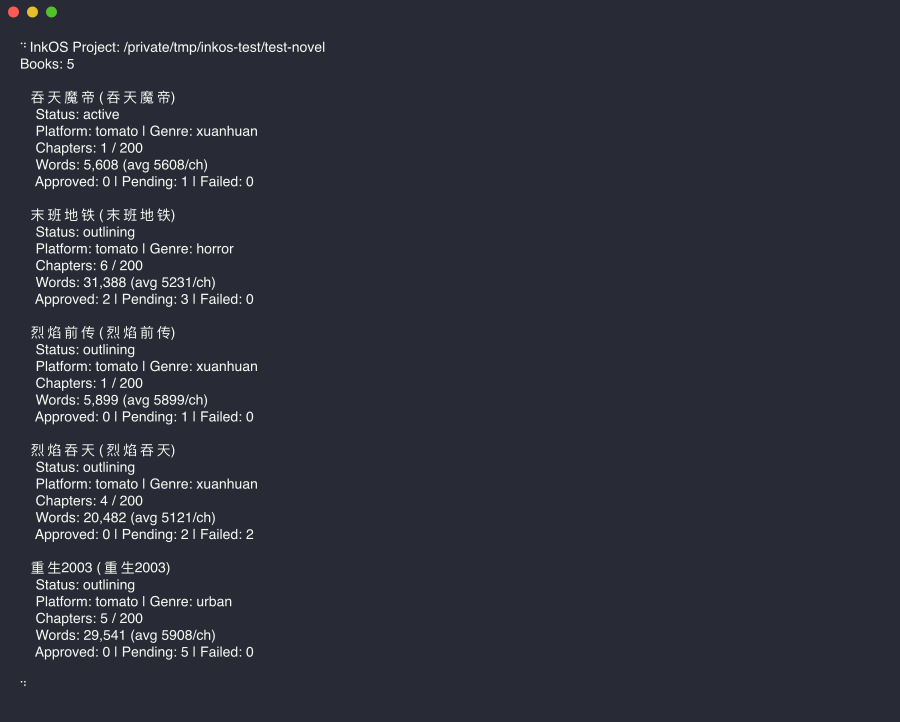
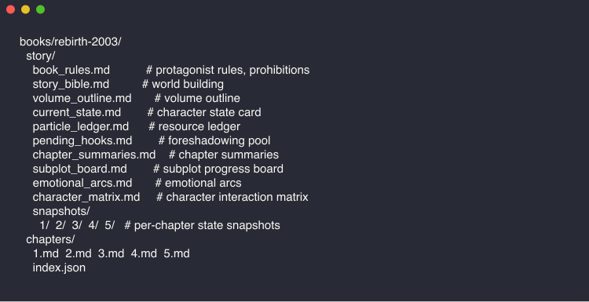
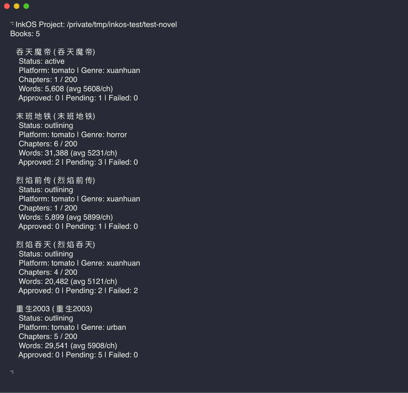

<h1 align="center">NovelFork<br><sub>网文小说 AI 辅助创作工作台</sub></h1>

<p align="center">
  <a href="LICENSE"></a>
  <a href="https://nodejs.org/"></a>
  <a href="https://www.typescriptlang.org/"></a>
</p>

---

**NovelFork** 是从 [InkOS](https://github.com/Narcooo/inkos) fork 出来的项目，专注于中文网文小说创作的 AI 辅助工作台。

基于多 Agent 协作的写作管线：规划、编排、写作、审计、修订全流程自动化。支持玄幻、仙侠、都市、科幻等题材，内置连续性审计、文风仿写、去 AI 味等功能。

**NovelFork Studio** — `novelfork studio` 启动本地 Web 工作台。书籍管理、章节审阅编辑、实时写作进度、数据分析、AI 检测、文风分析、题材管理、守护进程控制、真相文件编辑——CLI 能做的，Studio 全部可视化。

## 欢迎交流

> Fork 自 InkOS，专注中文网文创作场景。
> 欢迎提 issue 反馈问题、提出需求。

## 快速开始

### 安装

```bash
# 从源码安装
git clone https://github.com/vivy1024/inkos.git novelfork
cd novelfork
pnpm install
pnpm build
npm link packages/cli
```

### 配置

**方式一：全局配置（推荐，只需一次）**

```bash
novelfork config set-global \
  --provider <openai|anthropic|custom> \
  --base-url <API 地址> \
  --api-key <你的 API Key> \
  --model <模型名>

# provider: openai / anthropic / custom（兼容 OpenAI 格式的中转站选 custom）
# base-url: 你的 API 提供商地址
# api-key: 你的 API Key
# model: 你的模型名称
```

配置保存在 `~/.novelfork/.env`，所有项目共享。之后新建项目不用再配。

**方式二：项目级 `.env`**

```bash
novelfork init my-novel     # 初始化项目
# 编辑 my-novel/.env
```

```bash
# 必填
NOVELFORK_LLM_PROVIDER=                               # openai / anthropic / custom（兼容 OpenAI 接口的都选 custom）
NOVELFORK_LLM_BASE_URL=                               # API 地址（支持中转站、智谱、Gemini 等）
NOVELFORK_LLM_API_KEY=                                 # API Key
NOVELFORK_LLM_MODEL=                                   # 模型名

# 可选
# NOVELFORK_LLM_TEMPERATURE=0.7                       # 温度
# NOVELFORK_LLM_MAX_TOKENS=8192                        # 最大输出 token
# NOVELFORK_LLM_THINKING_BUDGET=0                      # Anthropic 扩展思考预算
```

项目 `.env` 会覆盖全局配置。不需要覆盖时可以不写。

**方式三：多模型路由（可选）**

给不同 Agent 分配不同模型，按需平衡质量与成本：

```bash
# 给不同 agent 配不同模型/提供商
novelfork config set-model writer <model> --provider <provider> --base-url <url> --api-key-env <ENV_VAR>
novelfork config set-model auditor <model> --provider <provider>
novelfork config show-models        # 查看当前路由
```

未单独配置的 Agent 自动使用全局模型。

### Fork 说明

NovelFork 基于 InkOS v1.1.1 fork，保留了核心的多 Agent 写作管线，专注于中文网文创作场景的优化和定制。

主要改动：
- 移除 OpenClaw Skill 集成
- 移除英文/日文多语言支持
- 专注中文网文题材（玄幻、仙侠、都市、科幻）
- 简化安装和配置流程

### 写第一本书

```bash
novelfork book create --title "吞天魔帝" --genre xuanhuan  # 创建新书
novelfork write next 吞天魔帝      # 写下一章（完整管线：草稿 → 审计 → 修订）
novelfork status                   # 查看状态
novelfork review list 吞天魔帝     # 审阅草稿
novelfork review approve-all 吞天魔帝  # 批量通过
novelfork export 吞天魔帝          # 导出全书
novelfork export 吞天魔帝 --format epub  # 导出 EPUB（手机/Kindle 阅读）
```

<p align="center">
  
</p>

---

## 核心特性

### 多维度审计 + 去 AI 味

连续性审计员从 33 个维度检查每一章草稿：角色记忆、物资连续性、伏笔回收、大纲偏离、叙事节奏、情感弧线等。内置 AI 痕迹检测维度，自动识别"LLM 味"表达（高频词、句式单调、过度总结），审计不通过自动进入修订循环。

去 AI 味规则内置于写手 agent 的 prompt 层——词汇疲劳词表、禁用句式、文风指纹注入，从源头减少 AI 生成痕迹。`revise --mode anti-detect` 可对已有章节做专门的反检测改写。

### 文风仿写

`novelfork style analyze` 分析参考文本，提取统计指纹（句长分布、词频特征、节奏模式）和 LLM 风格指南。`novelfork style import` 将指纹注入指定书籍，后续所有章节自动采用该风格，修订者也会用风格标准做审计。

### 创作简报

`novelfork book create --brief my-ideas.md` 传入你的脑洞、世界观设定、人设文档。建筑师 agent 会基于简报生成故事设定（`story_bible.md`）和创作规则（`book_rules.md`），而非凭空创作；同时把简报落盘到 `story/author_intent.md`，让这本书的长期创作意图不会只在建书时生效一次。

### 输入治理控制面

每本书现在都有两份长期可编辑的 Markdown 控制文档：

- `story/author_intent.md`：这本书长期想成为什么
- `story/current_focus.md`：最近 1-3 章要把注意力拉回哪里

写作前可以先跑：

```bash
novelfork plan chapter 吞天魔帝 --context "本章先把注意力拉回师徒矛盾"
novelfork compose chapter 吞天魔帝
```

这会生成 `story/runtime/chapter-XXXX.intent.md`、`context.json`、`rule-stack.yaml`、`trace.json`。其中 `intent.md` 给人看，其他文件给系统执行和调试。`plan` / `compose` 只编译本地文档和状态，不依赖在线 LLM，可在没配好 API Key 前先验证控制输入。

### 字数治理

`draft`、`write next`、`revise` 现在共享同一套保守型字数治理：

- `--words` 指定的是目标字数，系统会自动推导一个允许区间，不承诺逐字精确命中
- 中文默认按 `zh_chars` 计数，英文默认按 `en_words` 计数
- 如果正文超出允许区间，NovelFork 最多只会追加 1 次纠偏归一化（压缩或补足），不会直接硬截断正文
- 如果 1 次纠偏后仍然超出 hard range，章节照常保存，但会在结果和 chapter index 里留下长度 warning / telemetry

### 续写已有作品

`novelfork import chapters` 从已有小说文本导入章节，自动逆向工程 7 个真相文件（世界状态、角色矩阵、资源账本、伏笔钩子等），支持 `第X章` 和自定义分割模式、断点续导。导入后 `novelfork write next` 无缝接续创作。

### 同人创作

`novelfork fanfic init --from source.txt --mode canon` 从原作素材创建同人书。支持四种模式：canon（正典延续）、au（架空世界）、ooc（性格重塑）、cp（CP 向）。内置正典导入器、同人专属审计维度和信息边界管控——确保设定不矛盾。

### 多模型路由

不同 Agent 可以走不同模型和 Provider。写手用 Claude（创意强），审计用 GPT-4o（便宜快速），雷达用本地模型（零成本）。`novelfork config set-model` 按 agent 粒度配置，未配置的自动回退全局模型。

### 守护进程 + 通知推送

`novelfork up` 启动后台循环自动写章。管线对非关键问题全自动运行，关键问题暂停等人工审核。通知推送支持 Telegram、飞书、企业微信、Webhook（HMAC-SHA256 签名 + 事件过滤）。日志写入 `novelfork.log`（JSON Lines），`-q` 静默模式。

### 本地模型兼容

支持任何 OpenAI 兼容接口（`--provider custom`）。Stream 自动降级——中转站不支持 SSE 时自动回退 sync。Fallback 解析器处理小模型不规范输出，流中断时自动恢复部分内容。

### 可靠性保障

每章自动创建状态快照，`novelfork write rewrite` 可回滚任意章节。写手动笔前输出自检表（上下文、资源、伏笔、风险），写完输出结算表，审计员交叉验证。文件锁防止并发写入。写后验证器含跨章重复检测和 11 条硬规则自动 spot-fix。

伏笔系统使用 Zod schema 校验——`lastAdvancedChapter` 必须是整数，`status` 只能是 open/progressing/deferred/resolved。LLM 输出的 JSON delta 在写入前经过 `applyRuntimeStateDelta` 做 immutable 更新 + `validateRuntimeState` 结构校验。坏数据直接拒绝，不会滚雪球。

用户设置的 `NOVELFORK_LLM_MAX_TOKENS` 作为全局上限生效，`llm.extra` 中的保留键（max_tokens、temperature 等）被自动过滤，防止意外覆盖。

---

## 工作原理

每一章由多个 Agent 接力完成，全程零人工干预：

<p align="center">
  
</p>

| Agent | 职责 |
|-------|------|
| **雷达 Radar** | 扫描平台趋势和读者偏好，指导故事方向（可插拔，可跳过） |
| **规划师 Planner** | 读取作者意图 + 当前焦点 + 记忆检索结果，产出本章意图（must-keep / must-avoid） |
| **编排师 Composer** | 从全量真相文件中按相关性选择上下文，编译规则栈和运行时产物 |
| **建筑师 Architect** | 规划章节结构：大纲、场景节拍、节奏控制 |
| **写手 Writer** | 基于编排后的精简上下文生成正文（字数治理 + 对话引导） |
| **观察者 Observer** | 从正文中过度提取 9 类事实（角色、位置、资源、关系、情感、信息、伏笔、时间、物理状态） |
| **反射器 Reflector** | 输出 JSON delta（而非全量 markdown），由代码层做 Zod schema 校验后 immutable 写入 |
| **归一化器 Normalizer** | 单 pass 压缩/扩展，将章节字数拉入允许区间 |
| **连续性审计员 Auditor** | 对照 7 个真相文件验证草稿，33 维度检查 |
| **修订者 Reviser** | 修复审计发现的问题 — 关键问题自动修复，其他标记给人工审核 |

如果审计不通过，管线自动进入"修订 → 再审计"循环，直到所有关键问题清零。

### 长期记忆

每本书维护 7 个真相文件作为唯一事实来源：

| 文件 | 用途 |
|------|------|
| `current_state.md` | 世界状态：角色位置、关系网络、已知信息、情感弧线 |
| `particle_ledger.md` | 资源账本：物品、金钱、物资数量及衰减追踪 |
| `pending_hooks.md` | 未闭合伏笔：铺垫、对读者的承诺、未解决冲突 |
| `chapter_summaries.md` | 各章摘要：出场人物、关键事件、状态变化、伏笔动态 |
| `subplot_board.md` | 支线进度板：A/B/C 线状态、停滞检测 |
| `emotional_arcs.md` | 情感弧线：按角色追踪情绪变化和成长 |
| `character_matrix.md` | 角色交互矩阵：相遇记录、信息边界 |

连续性审计员对照这些文件检查每一章草稿。如果角色"记起"了从未亲眼见过的事，或者拿出了两章前已经丢失的武器，审计员会捕捉到。

从 0.6.0 起，真相文件的权威来源从 markdown 迁移到 `story/state/*.json`（Zod schema 校验）。Settler 不再输出完整 markdown 文件，而是输出 JSON delta，由代码层做 immutable apply + 结构校验后写入。markdown 文件仍然保留作为人类可读的投影。旧书首次运行时自动从 markdown 迁移到结构化 JSON，零人工操作。

Node 22+ 环境下自动启用 SQLite 时序记忆数据库（`story/memory.db`），支持按相关性检索历史事实、伏笔和章节摘要，避免全量注入导致的上下文膨胀。

<p align="center">
  
</p>

### 控制面与运行时产物

除了 7 个真相文件，NovelFork 还把”护栏”和”自定义”拆成可审阅的控制层：

- `story/author_intent.md`：长期作者意图
- `story/current_focus.md`：当前阶段的关注点
- `story/runtime/chapter-XXXX.intent.md`：本章目标、保留项、避免项、冲突处理
- `story/runtime/chapter-XXXX.context.json`：本章实际选入的上下文
- `story/runtime/chapter-XXXX.rule-stack.yaml`：本章的优先级层和覆盖关系
- `story/runtime/chapter-XXXX.trace.json`：本章输入编译轨迹

这样 `brief`、卷纲、书级规则、当前任务不再混成一坨 prompt，而是先编译，再写作。

### 创作规则体系

写手 agent 内置 ~25 条通用创作规则（人物塑造、叙事技法、逻辑自洽、语言约束、去 AI 味），适用于所有题材。

在此基础上，每个题材有专属规则（禁忌、语言约束、节奏、审计维度），每本书有独立的 `book_rules.md`（主角人设、数值上限、自定义禁令）、`story_bible.md`（世界观设定）、`author_intent.md`（长期方向）和 `current_focus.md`（近期关注点）。`volume_outline.md` 仍然是默认规划，但在 v2 输入治理模式下不再天然压过当前任务意图。

## 使用模式

NovelFork 提供三种交互方式，底层共享同一组原子操作：

### 1. 完整管线（一键式）

```bash
novelfork write next 吞天魔帝          # 写草稿 → 审计 → 自动修订，一步到位
novelfork write next 吞天魔帝 --count 5 # 连续写 5 章
```

`write next` 现在默认走 `plan -> compose -> write` 的输入治理链路。若你需要回退到旧的 prompt 拼装路径，可在 `novelfork.json` 中显式设置：

```json
{
  "inputGovernanceMode": "legacy"
}
```

默认值为 `v2`。`legacy` 仅作为显式 fallback 保留。

### 2. 原子命令（可组合）

```bash
novelfork plan chapter 吞天魔帝 --context "本章重点写师徒矛盾" --json
novelfork compose chapter 吞天魔帝 --json
novelfork draft 吞天魔帝 --context "本章重点写师徒矛盾" --json
novelfork audit 吞天魔帝 31 --json
novelfork revise 吞天魔帝 31 --json
```

每个命令独立执行单一操作，`--json` 输出结构化数据。`plan` / `compose` 负责控制输入，`draft` / `audit` / `revise` 负责正文与质量链路。

### 3. 自然语言 Agent 模式

```bash
novelfork agent "帮我写一本都市修仙，主角是个程序员"
novelfork agent "写下一章，重点写师徒矛盾"
novelfork agent "先扫描市场趋势，然后根据结果创建一本新书"
```

内置 18 个工具，LLM 通过 tool-use 决定调用顺序。推荐的 Agent 工作流是：先调整控制面，再 `plan` / `compose`，最后决定写草稿还是跑完整管线。

## 实测数据

用 NovelFork 全自动跑了一本玄幻题材的《吞天魔帝》：

<p align="center">
  
</p>

| 指标 | 数据 |
|------|------|
| 已完成章节 | 31 章 |
| 总字数 | 452,191 字 |
| 平均章字数 | ~14,500 字 |
| 审计通过率 | 100% |
| 资源追踪项 | 48 个 |
| 活跃伏笔 | 20 条 |
| 已回收伏笔 | 10 条 |

## 命令参考

| 命令 | 说明 |
|------|------|
| `novelfork init [name]` | 初始化项目（省略 name 在当前目录初始化） |
| `novelfork book create` | 创建新书（`--genre`、`--platform`、`--chapter-words`、`--target-chapters`、`--brief <file>` 传入创作简报） |
| `novelfork book update [id]` | 修改书设置（`--chapter-words`、`--target-chapters`、`--status`） |
| `novelfork book list` | 列出所有书籍 |
| `novelfork book delete <id>` | 删除书籍及全部数据（`--force` 跳过确认） |
| `novelfork genre list/show/copy/create` | 查看、复制、创建题材 |
| `novelfork plan chapter [id]` | 生成下一章的 `intent.md`（`--context` / `--context-file` 传入当前指令） |
| `novelfork compose chapter [id]` | 生成下一章的 `context.json`、`rule-stack.yaml`、`trace.json` |
| `novelfork write next [id]` | 完整管线写下一章（`--words` 覆盖字数，`--count` 连写，`-q` 静默模式） |
| `novelfork write rewrite [id] <n>` | 重写第 N 章（恢复状态快照，`--force` 跳过确认，`--words` 覆盖字数） |
| `novelfork draft [id]` | 只写草稿（`--words` 覆盖字数，`-q` 静默模式） |
| `novelfork audit [id] [n]` | 审计指定章节 |
| `novelfork revise [id] [n]` | 修订指定章节 |
| `novelfork agent <instruction>` | 自然语言 Agent 模式 |
| `novelfork review list [id]` | 审阅草稿 |
| `novelfork review approve-all [id]` | 批量通过 |
| `novelfork status [id]` | 项目状态 |
| `novelfork export [id]` | 导出书籍（`--format txt/md/epub`、`--output <path>`、`--approved-only`） |
| `novelfork radar scan` | 扫描平台趋势 |
| `novelfork fanfic init` | 从原作素材创建同人书（`--from`、`--mode canon/au/ooc/cp`） |
| `novelfork config set-global` | 设置全局 LLM 配置（~/.novelfork/.env） |
| `novelfork config show-global` | 查看全局配置 |
| `novelfork config set/show` | 查看/更新项目配置 |
| `novelfork config set-model <agent> <model>` | 为指定 agent 设置模型覆盖（`--base-url`、`--provider`、`--api-key-env` 支持多 Provider 路由） |
| `novelfork config remove-model <agent>` | 移除 agent 模型覆盖（回退到默认） |
| `novelfork config show-models` | 查看当前模型路由 |
| `novelfork doctor` | 诊断配置问题（含 API 连通性测试 + 提供商兼容性提示） |
| `novelfork detect [id] [n]` | AIGC 检测（`--all` 全部章节，`--stats` 统计） |
| `novelfork style analyze <file>` | 分析参考文本提取文风指纹 |
| `novelfork style import <file> [id]` | 导入文风指纹到指定书 |
| `novelfork import canon [id] --from <parent>` | 导入正传正典到番外书 |
| `novelfork import chapters [id] --from <path>` | 导入已有章节续写（`--split`、`--resume-from`） |
| `novelfork analytics [id]` / `novelfork stats [id]` | 书籍数据分析（审计通过率、高频问题、章节排名、token 用量） |
| `novelfork update` | 更新到最新版本 |
| `novelfork studio` | 启动 Web 工作台（`-p` 指定端口，默认 4567） |
| `novelfork up / down` | 启动/停止守护进程（`-q` 静默模式，自动写入 `novelfork.log`） |

`[id]` 参数在项目只有一本书时可省略，自动检测。所有命令支持 `--json` 输出结构化数据。`draft` / `write next` / `plan chapter` / `compose chapter` 支持 `--context` 传入创作指导，`--words` 覆盖每章目标字数。`book create` 支持 `--brief <file>` 传入创作简报（你的脑洞/设定文档），Architect 会基于此生成设定而非凭空创作。`plan chapter` / `compose chapter` 不要求在线 LLM，可在配置 API Key 之前先检查输入治理结果。

## 路线图

- [x] ~~`packages/studio` Web UI 工作台（Vite + React + Hono）~~ — 已发布，`novelfork studio` 启动
- [ ] 互动小说（分支叙事 + 读者选择）
- [ ] 局部干预（重写半章 + 级联更新后续 truth 文件）
- [ ] 自定义 agent 插件系统
- [ ] 平台格式导出（起点、番茄等）

## 参与贡献

欢迎贡献代码。提 issue 或 PR。

```bash
pnpm install
pnpm dev          # 监听模式
pnpm test         # 运行测试
pnpm typecheck    # 类型检查
```

## 许可证

[MIT](LICENSE)

---

**致谢**：本项目基于 [InkOS](https://github.com/Narcooo/inkos) v1.1.1 fork。感谢原作者 Narcooo 的开源贡献。
