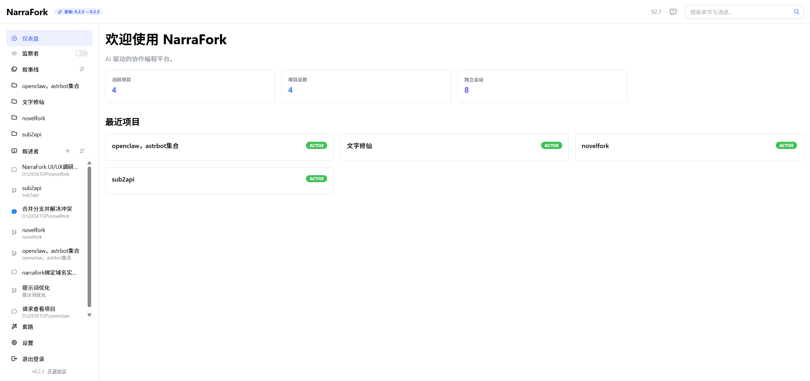
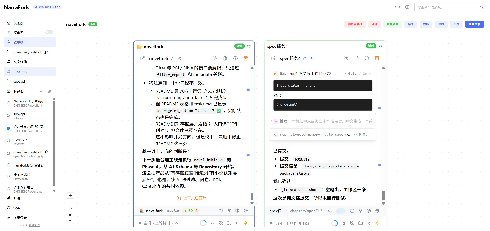
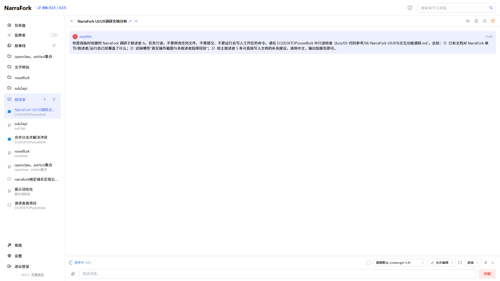
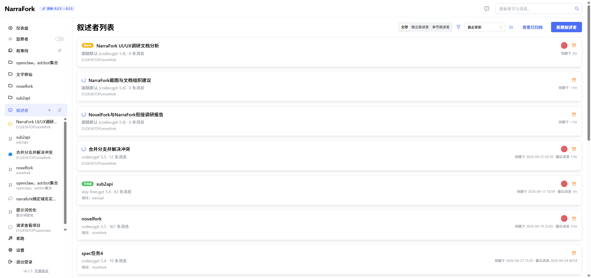
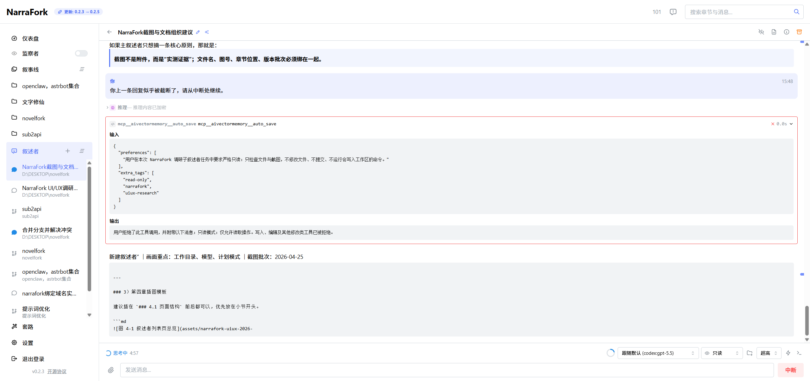
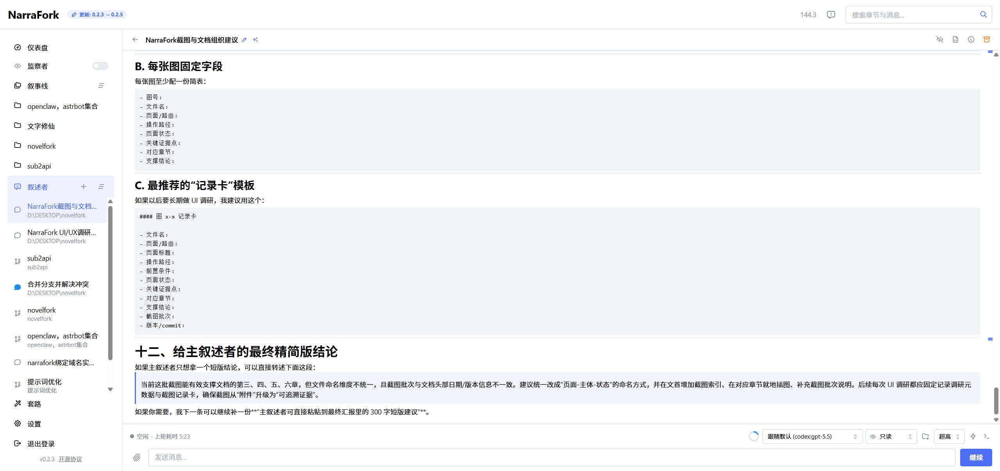

# NarraFork UI/UX 与交互功能调研

**版本**: v1.1.0
**创建日期**: 2026-04-28
**更新日期**: 2026-05-07
**状态**: 📚 参考资料
**文档类型**: reference

---

> 本文仅供设计和实现参考，不代表 NovelFork 当前已实现能力或产品承诺。

## 说明

本文件基于本地运行中的 NarraFork 实例实测整理，重点不是泛泛而谈“风格像什么”，而是回答下面几个问题：

1. NarraFork 的页面和交互到底怎么组织
2. 创建叙事线、独立叙述者、章节节点这些核心入口如何实现
3. 配置、权限、工具、MCP、请求历史等外围能力如何收口
4. NovelFork Studio 当前该学什么，不该机械照抄什么

本次调研方式：
- 实际打开本地 NarraFork 页面
- 读取页面 DOM 快照
- 观察关键弹窗、列表、表单、节点、卡片、对话页
- 结合已可见页面结构做对比分析

本次确认的 NarraFork 事实：
- 页面标题：`NarraFork`
- 版本：`v0.1.20`
- commit：`914cbad`
- 当前运行平台：`windows`

---

## 一、整体产品形态

### 1.1 NarraFork 的核心不是“一个聊天页”

NarraFork 实际上是一个围绕本地 AI 工作台构建的单体产品壳，核心对象不是文档，也不是单个聊天窗口，而是三类实体：

- **叙事线（Project）**：项目/仓库/主线工作空间
- **章节（Chapter/Node）**：项目内的具体工作节点，可分支、可拖拽排布
- **叙述者（Narrator）**：独立或挂在章节上的会话实体

这决定了它的 UI 不是传统 SaaS 后台，也不是纯 ChatGPT，而是：

> 左侧全局导航 + 中央工作区 + 项目节点/会话卡片 + 丰富的管理与配置页

### 1.2 整体导航结构

侧边栏是 NarraFork 的第一层信息架构：

1. 顶部：
   - 仪表盘
   - 监察者（全局 Overseer 开关 + 状态）
2. 中部：
   - 叙事线列表（可拖拽排序）
   - 叙述者列表（可拖拽排序）
3. 底部：
   - 管理
   - 套路
   - 设置
   - 退出登录
   - 版本 / 开源协议

这个结构有两个非常重要的特点：

- **业务对象与系统配置分层明显**：项目/会话在中部，系统级入口在底部
- **侧边栏不塞过多低频工具**：没有把所有功能都挤成一级菜单

这点对 NovelFork Studio 非常关键，因为 Studio 当前侧边栏入口明显偏多，低频项太容易“常驻占位”。

---

## 二、创建叙事线（Project）流程

### 2.1 入口位置

页面：`/projects`

主区域顶部：
- 标题：`叙事线`
- 主按钮：`新建叙事线`

这里不是在侧边栏直接创建，而是在列表页的主工作区里集中创建，符合“列表管理页负责新增”的后台习惯。

### 2.2 创建弹窗结构

点击 `新建叙事线` 会弹出模态框：`新建叙事线`

表单字段如下：

#### 基础字段
- `叙事线名称`（必填文本框）

#### 仓库来源（三选一单选）
- `已有仓库`
- `新建仓库`
- `克隆远程仓库`

当前默认选中：`已有仓库`

#### 流程模式（二选一单选）
- `经典`
- `标尺`

当前默认选中：`经典`

#### 路径输入
- `仓库路径`
- 辅助说明：`本地已有的 Git 仓库路径`
- 附带 `浏览` 按钮

#### 提交
- `创建`

### 2.3 这个设计说明了什么

NarraFork 对“项目”的理解不是抽象工作区，而是明确绑定 Git 仓库来源。也就是说：

- 新建项目时就要求用户定义仓库获取方式
- 项目和 Git/worktree 能力是天然耦合的
- “流程模式”在创建时就作为顶层项目属性写入，而不是后置设置

### 2.4 对 NovelFork Studio 的启示

NovelFork Studio 当前如果也要往 NarraFork 路线靠，项目创建页不要只做：
- 名称
- 本地路径

更合理的是一步把下面几件事一起定下来：
- 项目名
- 仓库来源（本地/新建/克隆）
- 工作流模式（写作模式/审校模式/策划模式等）
- 模板或题材初始化

也就是说，**项目创建应是“初始化工作流”的入口，而不是仅仅“建一个目录”**。

---

## 三、独立叙述者（Independent Narrator）

### 3.1 入口位置

有两个入口：

1. 侧边栏 `叙述者` 区域的 `新建会话`
2. 独立页面 `/narrators` 里的 `新建叙述者`

这说明 NarraFork 把“会话”视为一等对象，而不是项目详情里的附属弹窗。

### 3.2 创建弹窗结构

点击 `新建叙述者` 后，弹出模态框：`新建独立叙述者`

副标题说明非常清楚：

> 创建一个不绑定任何章节的独立 AI 叙述者。适用于一般问题和探索。

表单字段如下：

#### 工作目录
- 文本框：`工作目录`
- 说明：`留空则使用主目录`
- 附带 `浏览` 按钮

#### 模型
- 文本框/下拉：`模型`
- 说明：`“跟随默认”会始终使用设置中的默认模型`
- 当前值显示：`gpt-5.4`

#### 计划模式
- 复选框：`以计划模式启动`
- 说明：`叙述者会先制定计划再执行，需要你批准后才会实施`

#### 提交
- `创建叙述者`

### 3.3 独立叙述者的定位

从文案和字段设计可以看出，独立叙述者不是章节上的子聊天，而是：

- 用于一般问题
- 用于探索
- 可指定工作目录
- 可覆盖模型
- 可直接决定是否以计划模式启动

本质上它更像是一个“上下文明确、权限明确、工作目录明确”的 AI 工位。

### 3.4 对 NovelFork Studio 的启示

Studio 现在的 ChatPanel 更像“项目里的问答面板”，但如果要参考 NarraFork：

- 应该把“独立会话”从附属功能升级为正式对象
- 允许它不绑定当前书籍/章节
- 允许给它单独指定工作目录、模型、权限模式
- 允许它做探索型任务，而不是只做写作补充

这对未来的：
- 资料整理
- 提纲探索
- 外部项目借鉴
- 提示词试验
- 设定分析

都很有价值。

---

## 四、叙述者列表页

页面：`/narrators`

### 4.1 页面结构

顶部工具区包含：
- 类型筛选：`全部 / 独立叙述者 / 章节叙述者`
- 排序方式：默认 `最近更新`
- 已归档入口：`查看已归档`
- 主按钮：`新建叙述者`

下方是叙述者卡片列表。

### 4.2 列表项信息密度

每个叙述者项至少包含：
- 标题
- 头像/缩写标识
- 模型名
- 消息条数
- 创建时间
- 最后消息时间
- 关联项目或工作目录
- 更多操作按钮

部分项还会显示：
- `项目：novelfork`
- `D:\DESKTOP\文字修仙`
- `Global Overseer`
- 错误状态等特殊标记

### 4.3 设计价值

这个列表页说明 NarraFork 没把“会话管理”藏在侧边栏里，而是提供了完整的管理页：

- 可筛选
- 可排序
- 可归档查看
- 可区分独立/章节叙述者

这比单纯在侧边栏堆会话条目要强得多。

### 4.4 对 Studio 的启示

Studio 如果后续保留多 Agent / 多会话体系，最好不要只靠侧边栏小列表管理。应额外有一个正式的“会话中心”页，用来：

- 管理写作会话
- 查看最近活跃 Agent
- 区分绑定章节 vs 独立任务
- 支持归档与恢复

---

## 五、叙述者对话页

页面：`/narrators/:id`

这次实测看到的就是当前对话所在页面本身。

### 5.1 顶部工具栏

在消息流上方，实测可见：
- 面包屑/项目路径：`🏠 novelfork · master`
- 上下文指示器：`Context: 23.5%` / `27.5%`
- 模型选择器：完整供应商与模型列表
- 权限模式选择器：如 `全部允许`
- 推理强度选择：如 `高`

### 5.2 底部输入区

底部至少有：
- 多行输入框：`发送消息...`
- 发送/中断按钮
- 若正在运行，会显示 `思考中 x:xx`

### 5.3 页面中的透明化能力

对话页不只是消息流，而是把系统执行过程直接展示出来：
- 工具调用块（例如 chromedevtools 调用）
- Agent / Explore 子代理卡片
- 每步耗时
- 查看源码 / 复制 / 全屏查看 等辅助动作

### 5.4 设计上的关键点

NarraFork 的叙述者页核心价值不是“长得像聊天”，而是：

- **让 AI 的执行过程可见**
- **让上下文消耗可见**
- **让模型、权限、推理强度在当前会话页可即时调整**

这点比 Studio 当前“底部聊天面板 + 隐形执行”更成熟。

---

## 六、项目详情页与章节系统

页面：`/projects/:id`

### 6.1 顶部操作区

项目详情页 शीर्ष部可见按钮：
- `删除叙事线`
- `清理`
- `批量合并`
- `命令`
- `技能`
- `套路`
- `设置`
- `新建章节`

这说明项目页是：
- 内容工作区
- Git/清理工作区
- 配置入口聚合区

三者合一。

### 6.2 中央是节点图，不是普通列表

项目内章节不是普通树或列表，而是基于流程图/节点图渲染：
- 页面存在 `Zoom In / Zoom Out / Fit View / Toggle Interactivity`
- 节点使用 group/node 结构
- 说明其底层是图编辑器（很明显是流程图组件）

每个章节节点里包含：
- 章节编号/标题
- 状态（如 `活跃` / `空闲`）
- 编辑标题 / 生成标题
- 上下文指示图标
- 模型与权限的快捷菜单
- 输入框与发送按钮

### 6.3 这不是“页面跳转式章节编辑”

也就是说，NarraFork 的章节本身就是一个内嵌工作节点：
- 每个节点都能直接发消息
- 每个节点都像一个轻量会话卡
- 用户在项目页里就能同时看到多个章节节点

这比普通“点章节 → 进入详情页”的方式更偏向可视化工作流。

### 6.4 对 NovelFork Studio 的启示

Studio 当前更偏 IDE 文档流，章节是文档对象；NarraFork 更偏流程节点流，章节是任务/会话对象。

Studio 不必照抄成图编辑器，但可以吸收它两点：

1. **章节状态可视化**
   - 是否活跃
   - 是否空闲
   - 是否在运行 Agent
   - 上下文占用是否临界

2. **章节操作前置**
   - 不要把所有操作都塞到独立页面里
   - 在章节卡片/章节列表上直接提供：生成标题、AI 续写、审校、分叉、Git 操作

---

## 七、设置页（Settings）

页面：`/settings`

### 7.1 信息架构

设置页不是左侧二级导航，而是手风琴：
- 个人资料
- 模型
- AI 代理
- 章节与容器
- 通知
- 外观与界面
- 服务器与系统
- 关于

并且支持：
- `展开全部`

### 7.2 已实测到的详细内容

#### 个人资料
- 头像上传
- Git 用户名
- Git 邮箱

#### 模型
- 默认模型
- 摘要模型
- Explore / Plan 子代理模型偏好
- 各类型子代理模型池限制
- 全局默认推理强度
- Codex 默认推理强度
- `模型列表 →` 跳转入口

#### AI 代理
非常丰富，已实测到：
- 默认权限模式
- 每条消息最大轮次
- 旧编码支持
- 刷新 Shell 环境
- 翻译思考内容
- Dump 每条 API 请求
- 默认展开推理内容
- 默认宽松规划
- 智能检查输出中断
- 可恢复错误最大重试次数
- 重试退避时间上限
- 自定义可重试错误规则
- WebFetch 代理模式
- 上下文窗口阈值（标准 / 大窗口）
- 会话行为
- 调试项（显示 token 用量、实时 AI 输出速率）
- 全局目录/命令白名单黑名单

#### 关于
- 版本
- commit
- 平台
- 作者
- 更新日志入口

### 7.3 设置页的设计特点

NarraFork 的设置页有两个非常成熟的特点：

1. **不是只配置主题和账户，而是把 Agent 运行时也纳入设置体系**
2. **把“异常恢复 / 重试 / 阈值 / 白名单 / 黑名单”这种偏运维参数也前台化了**

这意味着它不是简单用户设置页，而是“产品运行控制面板”。

### 7.4 对 Studio 的启示

Studio 当前设置页如果只覆盖：
- 主题
- 编辑器
- 通知
- 关于

还不够。后续应考虑把这些能力也前移：
- 上下文阈值
- 默认模型
- 子 Agent 模型池
- 自动恢复 / 重试策略
- MCP/工具白名单黑名单

---

## 八、套路页（Routines）

页面：`/routines`

### 8.1 统一配置入口

这是 NarraFork 非常值得学习的页面。

顶部标签共实测到 **10 个**：
- 命令
- 可选工具
- 工具权限
- 全局技能
- 项目技能
- 自定义子代理
- 全局提示词
- 系统提示词
- MCP 工具
- 钩子

### 8.2 各标签实测内容

#### 命令
- 用户级斜杠命令
- 文案说明非常清晰：在聊天输入框中输入 `/命令名`
- 空态：暂无命令
- 操作：`添加命令`

#### 可选工具
- 每个工具一行
- 展示：名字 + `/LOAD` 命令 + 说明 + 开关
- 已看到：Terminal / ShareFile / Recall / Browser / ForkNarrator / NarraForkAdmin

#### 工具权限
- 当前页是说明 + `管理` 入口
- 用来统一查看内置工具和 MCP 工具权限分类，以及 Bash 白名单/黑名单规则

#### 全局技能
- 说明扫描路径
- 操作：`刷新`、`创建技能`

#### 自定义子代理
- 说明其作用：定义专用提示词和工具权限的自定义子代理类型
- 操作：`创建子代理`

#### MCP 工具
- 说明：配置外部 MCP 服务器
- 操作：`导入 JSON`、`添加 MCP 服务器`
- 已连接实例：
  - chromedevtools
  - github mcp
  - aivectormemory
- 每条都有：连接状态、传输方式、工具数量、断开、编辑

#### 钩子
- 说明：在关键生命周期节点运行 Shell / Webhook / LLM 提示词
- 操作：`创建钩子`

### 8.3 这个页面的本质

套路页本质上是：

> 把“AI 工作流的可编排能力”集中放到一个地方管理。

它不是单纯设置页，也不是插件页，而是把这些能力统一为工作流资源：
- 命令
- 技能
- 工具
- 权限
- MCP
- 提示词
- 钩子
- 子代理

### 8.4 对 Studio 的启示

NovelFork Studio 当前最值得直接借鉴的页面，就是这个。因为现在 Studio 的对应能力分散在：
- AgentPanel
- MCPServerManager
- PluginManager
- LLMAdvancedConfig
- 若干配置页面

用户认知负担很高。

最合理的改法不是“再加几个入口”，而是：

> 做一个统一的“工作流配置台”，把 Agent/MCP/技能/提示词/权限收口。

---

## 九、管理页（Admin）

### 9.1 管理首页

页面：`/admin`

当前并不是传统 tabs，而是一个“管理面板首页”，用卡片式入口组织子页面：
- 用户
- 供应商
- 终端
- 容器
- 储存空间
- 运行资源
- 请求历史

还有快捷操作：
- `重新打开设置向导`

### 9.2 供应商管理页

页面：`/admin/providers`

可见数据：
- 供应商总数
- 已启用数量
- 可用模型总数

分组方式：
- 平台集成
- API key 接入

每个供应商卡片展示：
- 平台名 / 供应商名
- 启用状态开关
- 模型数量
- 已验证 / 未验证状态
- 更多模型提示

这个页面清楚展示了“可用模型池”与“提供商来源”的关系。

### 9.3 请求历史页

页面：`/admin/usage-history`

这是 NarraFork 非常成熟的一块：

顶部统计卡实测到：
- 请求数
- 总 Tokens
- 输入/输出细分
- 平均 TTFT
- 平均耗时
- 总成本
- 推理 Tokens
- 缓存读取 / 缓存写入

筛选区包含：
- 提供商
- 模型
- 开始日期
- 结束日期
- 应用筛选 / 重置

表格列包括：
- 时间
- 叙述者
- 提供商
- 凭证
- 模型
- Tokens
- TTFT
- 耗时
- 成本
- 操作

数据里还能直接看到：
- 缓存写入细节
- 每次请求的 token 规模
- 叙述者与项目归属

### 9.4 储存空间 / 运行资源

页面：
- `/admin/storage`
- `/admin/runtime`

当前是扫描页：
- `扫描`
- “点击扫描以分析/检查……”

说明这两块是按需执行的后台运维面板，而不是默认就轮询的重页面。

### 9.5 对 Studio 的启示

Studio 现在如果只有“日志”而没有“请求历史 / 资源页 / 存储页”，那它在平台化上会明显偏弱。

尤其值得借鉴的是：
- 请求历史的表格化与筛选
- Token / TTFT / 耗时 / 成本的统一统计
- 将运维能力拆成子页，而不是塞进一个长页面

---

## 十、更新日志页

页面：`/changelog`

### 10.1 这不是简单版本号展示

更新日志页本身就是产品能力雷达。它已经能从版本记录中直接看出 NarraFork 重视什么：

- 多窗口/布局系统
- 终端工具
- 子代理透明化
- 请求历史
- 浏览器性能追踪
- 钩子系统
- 供应商管理
- 存储与资源管理
- 更新系统
- 权限系统
- 容器 / 浏览器 / WebFetch

### 10.2 对 Studio 的启示

如果 NovelFork Studio 以后也要变成长期演进的平台，而不是脚手架式产品，那么：

- 更新日志不应只是“修了几个 bug”
- 应明确记录产品能力层的演进方向
- 这能反过来约束功能边界和版本节奏

---

## 十一、NarraFork 的设计决策总结

### 11.1 值得直接学习

#### 1）把会话当一等对象
不是项目附属聊天框，而是可以单独创建、筛选、排序、归档、指定工作目录和模型的独立对象。

#### 2）把项目创建和 Git/流程初始化绑定
项目不是“空壳目录”，而是仓库来源 + 流程模式的组合体。

#### 3）把工作流配置统一收口
套路页是非常正确的产品决策。

#### 4）让 AI 执行过程透明化
上下文占用、工具调用、子代理调用、模型、权限、推理强度都在会话页可见。

#### 5）把平台运维能力前台化
请求历史、供应商、存储、运行资源、扫描页都已产品化。

### 11.2 不该机械照抄

#### 1）不必照搬成节点图编辑器
Studio 更偏文档编辑器，不必为了像 NarraFork 而强行把章节改成流程图。

#### 2）不必照搬 Mantine 风格
学习的是信息架构和交互组织，不是 UI 库本身。

#### 3）不必把一切都对话化
Studio 的核心价值仍然是写作工作台，不应为了像 NarraFork 而削弱编辑器体验。

---

## 十二、NovelFork Studio 当前最该补的点

### 第一优先级：信息架构
1. 侧边栏减负
2. 做统一工作流配置台
3. 做正式的会话中心/Agent 中心

### 第二优先级：AI 透明化
1. 上下文占用可视化
2. 工具调用日志
3. 模型/权限/推理强度即时可见可调

### 第三优先级：平台化能力
1. 请求历史页
2. 供应商管理页强化
3. 存储/资源/扫描类运维页

### 第四优先级：创建流程
1. 项目创建升级为“初始化工作流”
2. 独立会话升级为正式对象
3. 为章节/项目提供更前置的快捷动作

---

## 十三、对当前 Studio 的具体落地建议

### 13.1 立即可做
- 把 AgentPanel / MCP / Plugin / Prompt 相关入口合并成一个 `工作流配置` 页面
- 在 ChatPanel 加一个轻量上下文百分比指示器
- 在对话区增加“执行日志”折叠块
- 项目创建弹窗增加“仓库来源 / 工作流模板”

### 13.2 中期应做
- 新增 `会话中心` 页面，管理独立/章节绑定会话
- 新增 `请求历史` 页面
- 强化供应商管理页，显示模型数、状态、可用性

### 13.3 长期再做
- 章节状态看板 / 轻量节点化视图
- 会话归档、恢复、筛选、排序
- 钩子与工作流自动化系统

---

## 十四、2026-04-25 追加实操：多叙述者指挥与截图留存

本次追加调研的重点不是 NovelFork 源码，而是直接操作正在运行的 NarraFork 实例：`http://127.0.0.1:7778`。

### 14.1 本次截图留存

截图统一保存在：`docs/03-代码参考/assets/narrafork-uiux-2026-04-25/`

| 文件 | 记录内容 | 说明 |
|------|----------|------|
| `01-dashboard-after-login.png` | 登录后的仪表盘 | 可看到叙事线、叙述者、活跃章节、Token / 成本 / 待处理权限等总览卡片 |
| `02-novelfork-project-page.png` | `novelfork` 叙事线详情页 | 可看到项目节点图、顶部项目操作、章节节点、内嵌叙述者卡片 |
| `03-new-independent-narrator-modal.png` | 新建独立叙述者弹窗 | 可看到工作目录、模型、计划模式等创建字段 |
| `04-subnarrator-a-running.png` | 子叙述者 A 运行中 | 可看到独立叙述者对话页、运行状态、输入消息与底部模型/权限控件 |
| `05-narrators-list-after-dispatch.png` | 多叙述者派发后的列表页 | 可看到新建的调研叙述者进入队列/运行态 |
| `06-subnarrator-c-output.png` | 子叙述者 C 的输出页 | 可看到只读权限下的截图组织建议与输出被截断后自动继续 |
| `07-subnarrator-c-idle-final.png` | 子叙述者 C 完成后状态 | 可看到任务完成后的空闲状态、耗时与只读权限 |
| `01-novelfork-project-flow.png` | 早期项目节点图截图 | 保留作为节点图视角补充 |
| `02-novelfork-project-fitview.png` | 早期 Fit View 截图 | 保留作为画布缩放/适配视角补充 |

子叙述者 C 给出的截图管理建议值得保留：后续截图文件名最好统一为 `[序号]-[页面]-[主体]-[状态].png`，目录名承载产品名与日期，文件名只写页面、对象和状态。例如 `03-narrators-create-independent-modal.png` 比 `03-new-independent-narrator-modal.png` 更稳定；`04-narrator-detail-running-state.png` 比 `04-subnarrator-a-running.png` 更适合长期引用。本批次先保留原名以免破坏链接，后续新批次按该规范命名。

### 14.2 本次重新确认的 NarraFork 当前运行事实

本次实测时，NarraFork 顶栏显示：

- 当前可见版本：`v0.2.3`
- 更新提示：`0.2.3 -> 0.2.5`
- 当前页面仍是 `NarraFork` 单页应用
- 已登录用户：`vivy1024`
- 侧边栏仍以两组一等对象组织：`叙事线` 与 `叙述者`
- `novelfork` 是一个活跃叙事线，详情页 URL 形态为 `/projects/:id`
- 独立叙述者 URL 形态为 `/narrators/:id`

这说明 2026-04-20 文档里的对象模型仍然成立：

> 叙事线是项目级工作空间；章节是叙事线内的节点；叙述者是可独立存在、也可绑定章节的 AI 会话实体。

### 14.3 `novelfork` 叙事线页面的实操观察

进入 `novelfork` 后，项目页顶部仍是项目级操作聚合区，实测按钮包括：

- `删除叙事线`
- `清理`
- `批量合并`
- `命令`
- `技能`
- `套路`
- `设置`
- `新建章节`

中央仍是节点图，而不是普通章节表格。实测节点包括：

- `spec任务4`
- `novelfork`

节点内部可以直接看到消息流、工具调用、git 状态输出、运行耗时、上下文比例、模型与权限控件、输入框等。这进一步证明 NarraFork 的“章节”不是小说意义上的纯文本章节，而是一个可运行、可对话、可承载工具调用的工作节点。

### 14.4 独立叙述者创建与权限细节

点击侧边栏 `叙述者 -> 新建会话` 后，会出现 `新建独立叙述者` 弹窗。弹窗字段包括：

- `工作目录`：留空则使用主目录，也可指定到 `D:\DESKTOP\novelfork`
- `模型`：默认跟随设置中的默认模型，本次可见默认模型为 `gpt-5.4`
- `以计划模式启动`：创建后先制定计划，再等待用户批准实施
- `创建叙述者`

一个重要实操细节：弹窗里没有直接暴露权限模式。创建后的叙述者页底部才有权限下拉，默认可见为 `允许编辑`，并且可切换到：

- `逐项询问`
- `允许编辑`
- `全部允许`
- `只读`
- `规划模式`
- `全部拒绝`

这对后续借鉴很关键：如果 NovelFork Studio 以后提供“创建 Agent/叙述者”入口，权限模式不应只藏在会话页里，建议在创建弹窗里就能选择“只读 / 可编辑 / 规划模式”，避免用户误把探索任务放在可写模式下运行。

### 14.5 多叙述者并行指挥记录

本次实际创建并派发了 3 个互不冲突的调研叙述者：

| 代号 | 标题 | 工作目录 | 权限/约束 | 任务 |
|------|------|----------|-----------|------|
| A | `NarraFork UI/UX调研文档分析` | `D:\DESKTOP\novelfork` | UI 创建，默认 `允许编辑`；提示词明确只读 | 读取本文件，总结已有覆盖、缺口与可写入建议 |
| B | `NovelFork与NarraFork衔接调研报告` | `D:\DESKTOP\novelfork` | 创建时指定 `readOnly` | 只读检查 README / Kiro specs，分析 NovelFork 主线与 NarraFork 借鉴点 |
| C | `NarraFork截图与文档组织建议` | `D:\DESKTOP\novelfork` | 创建时指定 `readOnly` | 只读检查截图目录与本文结构，给出截图留存和文档组织建议 |

实操中观察到：

1. 叙述者标题会在运行后自动从首条任务消息生成，例如 `NarraFork UI/UX调研文档分析`。
2. 叙述者列表页能看到等待中、运行中、已完成、错误等状态。
3. 每个叙述者可以独立拥有工作目录、模型、权限模式与消息历史。
4. A 叙述者在调用 `mcp__aivectormemory__recall` 时进入待批准状态，页面内出现 `允许` / `拒绝` 按钮，说明工具权限审批是叙述者运行的一等状态。
5. B / C 创建时直接指定 `readOnly` 后，可以降低并行调研互相改文件的风险。

### 14.6 指挥多 AI 的经验

这次实际操作说明，NarraFork 的多叙述者更适合这样使用：

1. **拆成事实互不重叠的小任务**
   - A 只看既有调研文档
   - B 只看产品方向与 specs
   - C 只看截图目录与文档组织

2. **每条任务都写清楚禁止项**
   - 不修改文件
   - 不提交
   - 不运行会写入工作区的命令
   - 输出短报告即可

3. **能用只读权限就不要默认可写**
   - UI 创建的默认权限偏宽
   - 批量/程序化创建时应优先传入只读权限

4. **主叙述者要承担调度和归纳责任**
   - 子叙述者适合做局部事实整理
   - 最终判断、文档落点、截图命名与经验沉淀仍应由主叙述者统一收口

5. **截图比口述更可靠**
   - UI 变化、状态文字、按钮位置、权限弹窗都很难靠口述准确复现
   - 每次调研至少保存：入口页、目标页、创建弹窗、运行态、列表/结果页

### 14.7 对 NovelFork Studio 的新增启示

在原有“会话中心 / Agent 中心”建议之外，本次补充 4 条更具体的落地建议：

1. **创建 Agent 时前置权限选择**
   - NarraFork 当前独立叙述者创建弹窗没有权限字段，实际使用时容易默认可写。
   - Studio 可直接改进：创建 Agent 时必须选择 `只读 / 可编辑 / 计划模式`。

2. **把工具权限审批作为运行事件展示**
   - NarraFork 的 `允许 / 拒绝` 工具审批卡片很有价值。
   - Studio 的写作 Agent 如果要调用文件、数据库、外部 API，也应显示“当前卡在哪个权限点”。

3. **叙述者列表要显示真实运行态**
   - `等待中`、`运行中`、`已完成`、`错误` 比简单“在线/离线”更有指导意义。
   - 对多 Agent 写作流水线尤其重要。

4. **为并行任务提供调度模板**
   - 可预设“只读调研”“文档审查”“代码审查”“截图整理”等模板。
   - 模板内自动带禁止项和输出格式，减少用户每次手写调度词的成本。

---

## 十五、2026-05-07 追加实操：4567 NovelFork 与 7778 NarraFork 实际 UI 交互对比

本次追加记录来自同一台 Windows 本机的真实浏览器交互，不以组件单测或 Playwright 断言替代视觉体验判断。

### 15.1 验活范围与事实来源

实测入口：

| 产品 | 地址 | 访问状态 | 实测页面 |
|------|------|----------|----------|
| NovelFork Studio | `http://127.0.0.1:4567` | HTTP 200，页面标题 `NovelFork Studio` | `/next/settings`、`/next/books/agent-检验-202605030757`、左侧叙述者入口打开的 `/next/narrators/:sessionId` |
| NarraFork | `http://127.0.0.1:7778` | HTTP 200，页面标题 `NarraFork` | `/login`、`/` 仪表盘、`/settings`、`/projects`、`/projects/_S1zUZgaNH8AXbKcDjvJO`、`/narrators`、`/narrators/:id` |

本次实测还确认：
- 7778 NarraFork 当前可见版本为 `v0.4.1`，顶栏提示 `更新: 0.4.1 → 0.4.2`。
- NarraFork 登录页为 Mantine 风格卡片，支持登录/注册标签页；本次用临时审计账号完成注册并进入主界面，未在文档记录密码。
- NarraFork 仪表盘显示 `活跃项目 7`、`项目总数 7`、`独立会话 9`，最近项目包含 `novelfork`。
- NovelFork 4567 本机开发数据中残留多批 `E2E Provider ...`，说明浏览器 E2E 夹具会污染当前手工体验样本；后续正式发版前需要使用干净 root 或补测试夹具清理。

### 15.2 设置页体验对比

| 维度 | NarraFork 7778 实测 | NovelFork 4567 实测 | 结论 |
|------|---------------------|----------------------|------|
| 信息架构 | `/settings` 左侧为个人资料、模型、AI 代理、通知、外观与界面、IM 网关；页面仍在统一 Mantine AppShell 内。 | `/next/settings` 左侧为个人设置、实例管理、运行资源与审计、项目配置等分组；模型、AI 代理、AI 供应商入口清楚。 | NovelFork 的分组更贴近写作工作台，但视觉层级和控件密度还不如 NarraFork 成熟。 |
| 模型配置 | 模型页展示默认模型、摘要模型、Explore/Plan 子代理模型、子代理模型池、全局默认推理强度、Codex 默认推理强度、模型列表入口、模型聚合。 | 模型/AI 代理页已能展示默认模型、摘要模型、子代理模型池、权限、推理强度和运行策略；字段来自 SettingsTruthModel。 | NovelFork 已补齐真实来源口径，但本机样本里 E2E provider 太多，手工选择下拉体验明显受干扰。 |
| Agent runtime | AI 代理页字段非常全：默认权限、最大轮次、旧编码支持、刷新 Shell 环境、翻译思考、Dump API 请求、默认展开推理、默认计划模式、宽松规划、跳过只读危险反思、重试策略、首 token 超时、自定义可重试错误、WebFetch 代理、上下文阈值、会话滚动、语言要求、Token/速率调试、全局目录/命令 allow/deny。 | AI 代理页已展示权限与推理、模型选择、MCP 策略、工具 allow/block、上下文阈值、恢复重试、调试、目录规则；first-token timeout 明确 planned，不冒充 current。 | NovelFork 的 truthfulness 更强，但 NarraFork 的运行时控制项更完整、更像成熟产品控制台。 |
| Provider 管理 | 旧调研中的 `/admin/providers` 是独立管理页；本次 7778 设置页主要关注模型/Agent，未再次进入 admin provider 子页。 | `/next/settings -> AI 供应商` 显示平台集成与 API key 供应商，能区分账号、模型、可调用状态；但页面很长，开发样本里异常项与 E2E provider 影响观感。 | NovelFork 真实状态模型已优于过去，但正式 UI 需要增加筛选、折叠、清理测试夹具，避免“能力真实但像调试面板”。 |

### 15.3 叙事线 / 工作台体验对比

| 维度 | NarraFork 7778 实测 | NovelFork 4567 实测 | 结论 |
|------|---------------------|----------------------|------|
| 项目列表 | `/projects` 是卡片网格，顶部只有 `叙事线` 与 `新建叙事线`，最近项目卡片简洁。 | NovelFork 左侧 Agent Shell 直接列出当前书籍和会话，缺少单独的书籍/项目总览页体验。 | NovelFork 现在更像“打开了一个 IDE 工作区”，不是“产品首页”。这对作者初次进入不够友好。 |
| 项目详情 | NarraFork `novelfork` 叙事线顶部有 `删除叙事线`、`清理`、`批量合并`、`命令`、`技能`、`套路`、`设置`、`新建章节`；中央节点能看到工具调用、Git diff、日志与会话内容。 | NovelFork `/next/books/:bookId` 左侧资源树包含章节、候选稿、草稿、Story、Truth、经纬、叙事线；右侧写作动作显示 `生成下一章`、续写、审校、去 AI 味、伏笔建议；打开 Story 只读资源后能看到真实正文和保存禁用。 | NovelFork 的小说资源模型更贴合作家工作流；NarraFork 的项目页更适合多任务/多 Agent 指挥。两者方向不同，不能机械照抄节点图。 |
| 资源可理解性 | NarraFork 节点图适合 coding/project agent，但对小说章节正文不天然友好。 | NovelFork 资源树有明确 Story/Truth/经纬/章节边界，但当前按钮/徽标文字密集，视觉引导弱。 | NovelFork 应保留写作资源树，但需要更强的空态、分组折叠、当前资源强调和作者向说明。 |

### 15.4 叙述者 / 会话页体验对比

| 维度 | NarraFork 7778 实测 | NovelFork 4567 实测 | 结论 |
|------|---------------------|----------------------|------|
| 会话列表 | `/narrators` 顶部有搜索、`全部 / 独立叙述者 / 章节叙述者` 分段筛选、排序、查看已归档、新建叙述者；卡片显示标题、模型、消息数、创建时间、最后消息、项目/路径、运行/错误/完成等状态。 | NovelFork 侧边栏直接列出大量 `Planner 会话` 与写作会话，没有独立会话中心的筛选、排序、归档入口；长列表会挤占左栏。 | NovelFork 功能上已有 session-first，但管理体验仍落后 NarraFork；需要正式会话中心或至少侧边栏筛选/折叠。 |
| 会话页整体观感 | NarraFork 会话页在同一 Mantine AppShell 中，能同时看到项目路径、Git 分支、工作区状态、数据快照、上下文占比、模型、权限、推理强度、浏览器/工具状态、运行目标和消息流。 | NovelFork 会话页当前视觉像基础 HTML：标题 `Planner 会话` 过大；状态文本挤在一行（例如 `就绪anthropic / claude-sonnet-4-6权限：允许推理：mediumTokens...`）；模型/权限/推理控件贴顶排列；右侧大面积空白；输入框贴近底部且宽度/层级不清。 | NovelFork 的会话页已经有真实 API 和状态回读，但用户体感仍不是“成品软件”。Task 13 的 E2E 只能证明路径可用，不能证明视觉体验达标。 |
| 运行透明度 | NarraFork 能展示推理块、工具调用、Browser/Bash 等工具输出、耗时、上下文比例和中断状态；正在运行时底部按钮与状态清晰。 | NovelFork 已补工具卡 raw 脱敏、审批、context usage、运行控制，但空会话/少消息时几乎看不到这些能力，header 与控件缺少卡片化组织。 | NovelFork 需要把运行透明度“默认可见”：空态说明、最近工具区、上下文卡片、运行控制卡片，而不是只有测试夹具注入消息后才显现。 |
| 作者向适配 | NarraFork 的会话页更像 coding agent console，信息全但偏工程。 | NovelFork 会话页绑定书籍/章节、权限/模型可回读，理论上更贴合写作；但视觉与文案尚未把“写作助手”感做出来。 | NovelFork 不应照抄 NarraFork 的 coding console，但必须达到同等的产品完成度：清晰、卡片化、可理解、可操作。 |

### 15.5 本次实操暴露的 NovelFork 发布前风险

1. **功能验收与视觉验收必须分开记录**
   - Task 13 Playwright 已证明设置/会话路径可运行。
   - 但手工截图显示 `/next/narrators/:sessionId` 仍有明显视觉完成度问题，不能把“E2E passed”当作“UI 体验正常”。

2. **会话页是 v0.1.0 前最需要 UI polish 的页面**
   - 需要把 header facts、模型/权限/推理、context usage、运行控制、composer 拆成清晰区域。
   - 空态需要说明当前会话绑定、可做什么、为什么没有消息。
   - composer 需要固定宽度/最大宽度、按钮位置和发送状态，避免出现“底部白块 + 发送文字”的半成品观感。

3. **侧边栏会话长列表会拖低第一印象**
   - NarraFork 用 `/narrators` 正式管理页承接筛选、排序、归档。
   - NovelFork 当前把大量 Planner/写作会话堆在 Agent Shell 左栏，适合开发调试，不适合正式作者软件。

4. **开发 E2E 数据污染会影响手工验收**
   - 本机 4567 模型下拉中出现多批 `E2E Provider ...`。
   - v0.1.0 发版前实际验活必须使用干净 root，或 E2E 测试在结束后清理 provider/settings 夹具。

5. **NarraFork 仍是信息架构标杆，不是视觉库照抄对象**
   - NarraFork 的成熟点是对象管理、运行透明度、配置收口、状态密度。
   - NovelFork 应继续保持小说资源树、Story/Truth/经纬和候选稿边界，但补足产品壳完成度。

### 15.6 v0.1.0 前建议的最小 UI 体验门槛

若 v0.1.0 要对外发布，建议至少满足：

- `/next/narrators/:sessionId` 视觉重排：标题、状态、模型/权限/推理、Token、工作区绑定分区展示，不再拼成一行。
- 会话 composer 固定为完整输入条：输入框、发送/中断按钮、快捷提示在同一视觉容器内。
- 空会话显示作者向空态：当前绑定作品/章节、可用动作、模型配置状态、下一步建议。
- Agent Shell 左侧叙述者列表支持折叠或只显示最近 N 条，避免首次打开满屏历史会话。
- 手工验收用干净数据目录重新打开软件，避免 E2E provider/test book 影响发布截图与判断。
- 文档口径明确：NovelFork 当前在“真实合同/状态透明”上已通过一轮 hardening，但在“视觉完成度/信息布局”上仍需 polish，不得宣称已经达到 NarraFork UI 成熟度。

---

## 结论

这次实测后可以明确：

> NarraFork 真正领先的不是某个漂亮组件，而是“把 AI 工作台当产品平台来做”的完整度。

它在以下几点已经形成闭环：
- 项目创建
- 独立会话
- 章节节点
- 会话透明化
- 统一工作流配置
- 平台管理与请求追踪

NovelFork Studio 如果要继续主线演进，最值得学习的不是把界面改得更像 NarraFork，而是吸收它这套产品结构：

**对象建模清晰、配置收口清晰、AI 过程透明、运维能力前台化。**
