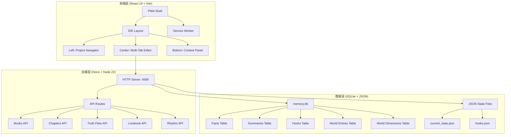

# InkOS v2.0 Implementation Spec Plan

**版本**: v1.0.0
**创建日期**: 2026-04-28
**更新日期**: 2026-04-28
**状态**: 🗄️ 历史归档
**文档类型**: archived

---

> 归档日期：2026-04-28。归档原因：旧文档体系迁移，仅供历史追溯；当前事实请从新文档中心入口查阅。

## 执行摘要

InkOS v2.0 将从 CLI 工具升级为桌面级 PWA 应用，核心升级包括：

1. **PWA 应用形态**：可安装到桌面，替代 Node SEA 方案
2. **IDE 三栏布局**：左导航 + 中编辑器 + 底上下文面板
3. **世界观引擎**：9 维度 SQLite 知识图谱 + Lorebook RAG
4. **网文行业标准**：节奏控制、黄金三章、伏笔倒计时、毒点检测
5. **AI 工具链**：内嵌终端、数据源接入、计算沙箱

**预计总工时**: 120-150 小时  
**实施周期**: 4 个阶段，每阶段 2-3 周  
**风险等级**: 中等（技术栈成熟，但集成复杂度高）

---

## 一、概述

### 1.1 项目背景

InkOS 是一个 AI 长篇小说生产工作台，定位为 **Scrivener 项目管理 + Cursor AI 能力 + 网文行业领域智能**。

**当前状态**（v1.1.1）：
- ✅ 已实现 60% 核心功能
- ✅ 10 Agent 写作管线完整
- ✅ SQLite 时序记忆系统
- ✅ 33 维连续性审计
- ✅ Web 工作台基础界面
- ✅ AI 工具系统（8 个工具）
- ✅ Git Worktree 多线并行

**目标状态**（v2.0.0）：
- 🎯 PWA 应用形态（可安装到桌面）
- 🎯 IDE 三栏布局（左导航 + 中编辑器 + 底上下文面板）
- 🎯 世界观引擎（9 维度 SQLite 知识图谱）
- 🎯 Lorebook RAG 检索（Token 降低 60%-80%）

- 🎯 网文行业标准集成（节奏控制、黄金三章、伏笔倒计时、毒点检测）
- 🎯 AI Agent 工具链（内嵌终端、数据源接入、计算沙箱）

### 1.2 技术栈

| 层级 | 技术选型 | 版本 | 用途 |
|------|---------|------|------|
| **前端框架** | React | 19.0 | UI 组件 |
| **构建工具** | Vite | 6.0 | 开发服务器 + 打包 |
| **PWA** | vite-plugin-pwa | 0.21+ | Service Worker + Manifest |
| **后端框架** | Hono | 4.7 | HTTP Server |
| **数据库** | SQLite (Node 22+) | 内置 | 世界观引擎 + 时序记忆 |
| **样式** | Tailwind CSS | 4.0 | 原子化 CSS |
| **UI 组件** | shadcn/ui | 最新 | 基础组件库 |
| **富文本编辑器** | TipTap | 2.27 | 章节编辑 |
| **拖拽** | @dnd-kit/core | 6.3+ | 章节排序 + 大纲拖拽 |
| **流程图** | @xyflow/react | 12.3+ | Pipeline 可视化 |
| **布局算法** | dagre | 0.8+ | DAG 自动布局 |
| **终端** | @xterm/xterm | 5.5+ | 终端 UI |
| **终端后端** | node-pty | 1.1+ | PTY 进程管理 |
| **网页抓取** | puppeteer-core | 23+ | 无头浏览器 |
| **内容提取** | @mozilla/readability | 0.5+ | 网页正文提取 |
| **类型校验** | Zod | 3.24 | 运行时数据验证 |
| **测试** | Vitest | 3.0 | 单元测试 + 集成测试 |

### 1.3 架构原则

1. **渐进式增强**：PWA 离线能力，但核心功能依赖本地 HTTP Server
2. **数据不可变**：所有状态更新返回新对象，避免副作用
3. **类型安全**：TypeScript 严格模式 + Zod 运行时校验
4. **测试优先**：80%+ 覆盖率，关键路径 100%
5. **性能优先**：虚拟滚动、懒加载、Web Worker 后台计算
6. **用户体验**：快捷键、命令面板、自动保存、崩溃恢复

---

## 二、需求分析

### 2.1 功能优先级矩阵

| 优先级 | 功能模块 | 工时估算 | 依赖关系 | 风险等级 |
|--------|---------|---------|---------|---------|
| **P0** | PWA 应用形态 | 8h | 无 | 低 |
| **P0** | IDE 三栏布局 | 16h | PWA | 中 |
| **P0** | 世界观引擎扩展 | 12h | 无 | 低 |
| **P0** | Lorebook RAG 检索 | 20h | 世界观引擎 | 中 |
| **P1** | 节奏控制系统 | 12h | 无 | 低 |
| **P1** | 黄金三章检测器 | 8h | 节奏控制 | 低 |
| **P1** | 伏笔倒计时系统 | 10h | 无 | 低 |
| **P1** | 毒点检测器 | 8h | 无 | 低 |

| **P2** | 内嵌终端 | 16h | 无 | 高 |
| **P2** | 数据源接入 | 12h | 无 | 中 |
| **P2** | 计算沙箱 | 14h | 内嵌终端 | 高 |
| **P3** | 拖拽交互 | 10h | IDE 布局 | 低 |
| **P3** | Pipeline 可视化 | 12h | 无 | 中 |
| **P3** | 会话持久化 | 6h | 无 | 低 |
| **P3** | 全局搜索增强 | 8h | 无 | 低 |
| **P4** | 雷达扫描增强 | 10h | 数据源接入 | 中 |
| **P4** | 创作数据分析 | 8h | 无 | 低 |
| **P4** | 导出增强 | 10h | 无 | 低 |
| **P4** | 插件系统 | 20h | 无 | 高 |

**总计**: 220 小时（实际可按阶段裁剪至 120-150 小时）

### 2.2 核心需求详述

#### P0-1: PWA 应用形态

**需求描述**：
- 用户可通过浏览器"安装"按钮将 InkOS 安装到桌面
- 安装后双击桌面图标即可启动，体验接近原生应用
- 离线模式下可查看已缓存的章节和设定文件
- 静态资源（HTML/CSS/JS/图标）使用 Cache First 策略
- API 请求使用 Network First 策略

**技术方案**：
- 使用 `vite-plugin-pwa` 生成 Service Worker
- 创建 `manifest.webmanifest` 配置文件
- 设计 PWA 图标（72x72 到 512x512 共 8 个尺寸）
- 实现安装提示组件（InstallPrompt.tsx）

**验收标准**：
- [ ] Chrome/Edge 地址栏显示安装图标
- [ ] 安装后桌面出现 InkOS 图标
- [ ] 双击图标可启动应用（无浏览器 UI）
- [ ] 离线模式下可查看已缓存内容
- [ ] Lighthouse PWA 评分 ≥ 90

#### P0-2: IDE 三栏布局

**需求描述**：
- **左侧导航**（260px，可调整 200-400px）：
  - 书籍列表（可折叠）
  - 章节列表（带状态标识：✓ 已批准 / ● 草稿 / ○ 未写）
  - 设定集分簇（人物/势力/规则/地理）
  - 系统工具（配置/日志/守护进程等）
- **中央编辑器**（自适应宽度）：
  - 多标签页（Tab Bar）
  - 富文本编辑器（章节）
  - Markdown 编辑器（设定文件）
  - 结构化视图（状态文件 JSON）
  - Ctrl+S 保存 + dirty 标记
- **底部上下文面板**（200px，可调整 120-400px，可折叠）：
  - Tab 1: Lorebook（实体识别 + 关键参数）
  - Tab 2: 伏笔追踪（倒计时 UI）
  - Tab 3: 节奏波形图（3+1 分析）
  - Tab 4: 世界观词条（维度浏览）

**技术方案**：
- 使用 CSS Grid 实现三栏布局
- 使用 `use-resizable` Hook 实现拖拽调整宽度
- 使用 `use-tabs-state` Hook 管理标签页状态
- 使用 IndexedDB 持久化布局配置

**验收标准**：
- [ ] 三栏布局响应式调整
- [ ] 左侧栏可拖拽调整宽度（200-400px）
- [ ] 底部面板可拖拽调整高度（120-400px）
- [ ] 底部面板可折叠/展开
- [ ] 刷新页面后布局配置保持
- [ ] 多标签页可切换、关闭、拖拽排序

#### P0-3: 世界观引擎 SQLite 扩展

**需求描述**：
- 扩展 `memory.db` 为通用世界观容器
- 9 个可插拔维度：角色、伏笔、道具、时间线、势力、物理规则、经济、地理、材料
- 每个维度独立表结构（已有 world_dimensions 和 world_entries）
- 支持自定义维度

**数据库设计**（已在 memory-db.ts 中实现）：

```sql
CREATE TABLE IF NOT EXISTS world_dimensions (
  id INTEGER PRIMARY KEY AUTOINCREMENT,
  key TEXT NOT NULL UNIQUE,
  label TEXT NOT NULL,
  description TEXT NOT NULL DEFAULT '',
  built_in INTEGER NOT NULL DEFAULT 0
);

CREATE TABLE IF NOT EXISTS world_entries (
  id INTEGER PRIMARY KEY AUTOINCREMENT,
  dimension TEXT NOT NULL,
  name TEXT NOT NULL,
  keywords TEXT NOT NULL DEFAULT '',
  content TEXT NOT NULL,
  priority INTEGER NOT NULL DEFAULT 100,
  enabled INTEGER NOT NULL DEFAULT 1,
  source_chapter INTEGER,
  created_at TEXT NOT NULL DEFAULT (datetime('now')),
  updated_at TEXT NOT NULL DEFAULT (datetime('now')),
  FOREIGN KEY (dimension) REFERENCES world_dimensions(key)
);
```

**技术方案**：
- 数据库表结构已完成（memory-db.ts 已实现）
- 需要实现前端 CRUD 界面（LorebookManager.tsx）
- 需要实现批量导入功能（从 YAML/JSON/Markdown）

**验收标准**：
- [ ] 可查看 9 个内置维度
- [ ] 可添加/编辑/删除词条
- [ ] 可添加自定义维度
- [ ] 可批量导入词条（YAML/JSON/Markdown）
- [ ] 可按维度筛选词条
- [ ] 可按关键词搜索词条

#### P0-4: Lorebook RAG 检索

**需求描述**：
- 从 prompt（goal + outlineNode）中提取实体词（人名、地名、术语）
- 查询 world_entries 表，按关键词匹配
- 按 priority 排序，按 token 预算裁剪（最多 2000 tokens）
- 注入到 Architect/Writer prompt
- Token 消耗降低 60%-80%

**技术方案**：

1. **NER 实体抽取**（`packages/core/src/utils/ner-extractor.ts`）：
   - 使用正则表达式识别中文人名、地名、术语、道具
   - 返回实体列表：`{ text: string, type: 'person' | 'location' | 'term' | 'item', confidence: number }`

2. **Lorebook 检索**（`packages/core/src/utils/lorebook-rag.ts`）：
   - 接收实体列表，查询 world_entries 表
   - 按 keywords 字段模糊匹配（LIKE '%entity%'）
   - 按 priority DESC 排序
   - 按 token 预算裁剪（使用 tiktoken 计算 token 数）
   - 返回注入内容字符串

3. **集成到 Composer**（`packages/core/src/agents/composer.ts`）：
   - 在 compose() 方法中调用 NER + Lorebook 检索
   - 将检索结果注入到 context 中
   - 传递给 Architect/Writer

**验收标准**：
- [ ] 可从文本中提取实体词（准确率 ≥ 80%）
- [ ] 可按实体词检索 Lorebook 词条
- [ ] 检索结果按优先级排序
- [ ] Token 预算控制在 2000 以内
- [ ] 实际 Token 消耗降低 60%-80%（对比全量注入）

---

## 三、架构设计

### 3.1 系统架构图



### 3.2 数据流设计

#### 3.2.1 写作流程（含 Lorebook 检索）

```
用户点击"写下一章" 
  → 前端发送 POST /books/:id/write-next
  → 后端启动 Pipeline
  → Planner 读取 author_intent.md + current_focus.md
  → Composer 准备上下文
    → 提取 goal + outlineNode 中的实体词（NER）
    → 查询 world_entries 表（Lorebook RAG）
    → 按 priority 排序，按 token 预算裁剪
    → 注入到 context
  → Architect 设计章节结构
  → Writer 生成正文
  → Observer 提取事实 → 写入 memory.db
  → Reflector 生成 JSON delta
  → Normalizer 字数归一化
  → Auditor 33 维审计
  → Reviser 自动修订
  → 保存章节 + 更新 state
  → SSE 推送进度到前端
  → 前端实时更新 UI
```

### 3.3 文件结构设计

```
inkos-master/
├── packages/
│   ├── core/
│   │   ├── src/
│   │   │   ├── agents/              # 10 Agent
│   │   │   ├── state/
│   │   │   │   ├── memory-db.ts     # SQLite 封装（已扩展 world_entries）
│   │   │   │   └── manager.ts       # 状态管理器
│   │   │   ├── utils/
│   │   │   │   ├── ner-extractor.ts    # 【新增】实体识别
│   │   │   │   └── lorebook-rag.ts     # 【新增】Lorebook RAG
│   │   │   └── models/
│   │   └── package.json
│   │
│   ├── studio/
│   │   ├── src/
│   │   │   ├── api/
│   │   │   │   ├── routes/
│   │   │   │   │   ├── lorebook.ts     # 【新增】Lorebook API
│   │   │   │   │   ├── rhythm.ts       # 【新增】节奏分析 API
│   │   │   │   │   └── hooks-countdown.ts  # 【新增】伏笔倒计时 API
│   │   │   │   └── lib/
│   │   │   │       └── rhythm-analyzer.ts  # 【新增】节奏分析器
│   │   │   │
│   │   │   ├── components/
│   │   │   │   ├── ContextPanel.tsx    # 【增强】底部上下文面板
│   │   │   │   ├── LorebookPanel.tsx   # 【新增】Lorebook 面板
│   │   │   │   ├── RhythmChart.tsx     # 【新增】节奏波形图
│   │   │   │   ├── HookCountdown.tsx   # 【新增】伏笔倒计时
│   │   │   │   └── InstallPrompt.tsx   # 【新增】PWA 安装提示
│   │   │   │
│   │   │   ├── pages/
│   │   │   │   ├── ChapterEditor.tsx   # 【新增】章节编辑器（IDE 模式）
│   │   │   │   ├── LorebookManager.tsx # 【新增】Lorebook 管理
│   │   │   │   └── RhythmAnalysis.tsx  # 【新增】节奏分析页
│   │   │   │
│   │   │   └── hooks/
│   │   │       ├── use-lorebook.ts     # 【新增】Lorebook Hook
│   │   │       └── use-rhythm.ts       # 【新增】节奏分析 Hook
│   │   │
│   │   ├── public/
│   │   │   ├── manifest.webmanifest    # 【新增】PWA Manifest
│   │   │   └── icons/                  # 【新增】PWA 图标
│   │   │
│   │   └── vite.config.ts              # 需添加 vite-plugin-pwa
│   │
│   └── cli/
│
└── docs/
    ├── 已实现功能清单.md
    ├── 未实现功能路线图.md
    └── spec-plan-v2.md                 # 【本文档】
```

---

## 四、实施计划

### 4.1 Phase 1: PWA + IDE 布局（2-3 周，56h）

**目标**：完成 PWA 应用形态 + IDE 三栏布局

**任务清单**：

1. **PWA 配置**（8h）
   - [ ] 安装 `vite-plugin-pwa`
   - [ ] 创建 `manifest.webmanifest`
   - [ ] 设计 PWA 图标（8 个尺寸）
   - [ ] 配置 Service Worker 缓存策略
   - [ ] 实现 `InstallPrompt.tsx` 组件
   - [ ] 测试安装流程

2. **IDE 三栏布局**（16h）
   - [ ] 重构 `App.tsx` 为 Grid 布局
   - [ ] 实现左侧导航栏（可调整宽度）
   - [ ] 实现底部上下文面板（可折叠）
   - [ ] 集成 `use-resizable` Hook
   - [ ] 实现布局配置持久化（IndexedDB）
   - [ ] 测试响应式调整

3. **多标签页增强**（12h）
   - [ ] 增强 `TabBar.tsx`（支持拖拽排序）
   - [ ] 实现 dirty 标记（未保存提示）
   - [ ] 实现 Ctrl+S 保存快捷键
   - [ ] 实现标签页持久化（刷新恢复）
   - [ ] 测试多标签页切换

4. **底部上下文面板基础**（12h）
   - [ ] 创建 `ContextPanel.tsx`（Tab 容器）
   - [ ] 创建 4 个 Tab 占位组件
   - [ ] 实现面板折叠/展开动画
   - [ ] 实现面板高度调整
   - [ ] 测试面板交互

5. **测试与优化**（8h）
   - [ ] E2E 测试（安装、布局调整、标签页）
   - [ ] Lighthouse PWA 评分（目标 ≥ 90）
   - [ ] 性能优化（首屏加载 < 2s）
   - [ ] 文档更新

**交付物**：
- PWA 可安装到桌面
- IDE 三栏布局完整
- 多标签页支持拖拽排序
- 底部上下文面板基础框架

### 4.2 Phase 2: 世界观引擎 + Lorebook RAG（2-3 周，52h）

**目标**：完成世界观引擎扩展 + Lorebook RAG 检索

**任务清单**：

1. **世界观引擎前端**（12h）
   - [ ] 创建 `LorebookManager.tsx` 页面
   - [ ] 实现维度列表展示
   - [ ] 实现词条 CRUD 界面
   - [ ] 实现批量导入功能（YAML/JSON/Markdown）
   - [ ] 实现关键词搜索
   - [ ] 测试 CRUD 操作

2. **NER 实体抽取**（8h）
   - [ ] 创建 `ner-extractor.ts`
   - [ ] 实现中文人名识别（正则）
   - [ ] 实现地名识别（正则）
   - [ ] 实现术语/道具识别（正则）
   - [ ] 单元测试（准确率 ≥ 80%）

3. **Lorebook RAG 检索**（12h）
   - [ ] 创建 `lorebook-rag.ts`
   - [ ] 实现关键词匹配查询
   - [ ] 实现优先级排序
   - [ ] 实现 token 预算裁剪（tiktoken）
   - [ ] 单元测试（覆盖率 100%）

4. **集成到 Composer**（8h）
   - [ ] 修改 `composer.ts`
   - [ ] 调用 NER 提取实体
   - [ ] 调用 Lorebook 检索
   - [ ] 注入到 context
   - [ ] 集成测试（验证 token 降低 60%-80%）

5. **Lorebook 面板**（12h）
   - [ ] 创建 `LorebookPanel.tsx`
   - [ ] 实时显示当前章节触发的词条
   - [ ] 实现词条高亮
   - [ ] 实现词条快速编辑
   - [ ] 测试实时更新

**交付物**：
- Lorebook 管理界面完整
- NER 实体抽取准确率 ≥ 80%
- Lorebook RAG 检索集成到写作管线
- Token 消耗降低 60%-80%

### 4.3 Phase 3: 网文行业标准（2-3 周，48h）

**目标**：完成节奏控制、黄金三章、伏笔倒计时、毒点检测

**任务清单**：

1. **节奏分析器**（12h）
   - [ ] 创建 `rhythm-analyzer.ts`
   - [ ] 实现 3+1 节奏检测算法
   - [ ] 实现张弛度计算（冲突密度 + 情感强度）
   - [ ] 实现节奏波形数据生成
   - [ ] 单元测试

2. **节奏波形图**（8h）
   - [ ] 创建 `RhythmChart.tsx`
   - [ ] 使用 Recharts 绘制波形图
   - [ ] 实现 3+1 节奏标注
   - [ ] 实现高压章节警告
   - [ ] 测试可视化

3. **黄金三章检测器**（8h）
   - [ ] 扩展 `rhythm-analyzer.ts`
   - [ ] 实现前 3 章节奏/冲突/悬念密度分析
   - [ ] 实现留人点检测（6000 字内卡点）
   - [ ] 实现毒点预警（7 条规则）
   - [ ] 单元测试

4. **伏笔倒计时系统**（10h）
   - [ ] 创建 `HookCountdown.tsx`
   - [ ] 从 hooks 表读取伏笔数据
   - [ ] 计算倒计时（当前章节 - 预期回收章节）
   - [ ] 实现过期伏笔警告
   - [ ] 实现伏笔快速跳转
   - [ ] 测试倒计时逻辑

5. **毒点检测器**（8h）
   - [ ] 创建 `poison-detector.ts`
   - [ ] 实现 7 条毒点规则
   - [ ] 集成到 Auditor
   - [ ] 创建 `PoisonAlert.tsx` 组件
   - [ ] 测试检测准确率

6. **集成到底部面板**（2h）
   - [ ] 将 RhythmChart 集成到 Tab 3
   - [ ] 将 HookCountdown 集成到 Tab 2
   - [ ] 测试面板切换

**交付物**：
- 节奏波形图可视化
- 黄金三章检测报告
- 伏笔倒计时 UI
- 毒点检测集成到审计系统

### 4.4 Phase 4: AI 工具链（可选，3-4 周，42h）

**目标**：完成内嵌终端、数据源接入、计算沙箱

**任务清单**：

1. **内嵌终端**（16h）
   - [ ] 安装 `@xterm/xterm` + `node-pty`
   - [ ] 创建 `TerminalPanel.tsx`
   - [ ] 实现 PTY 进程管理
   - [ ] 实现终端 UI（xterm.js）
   - [ ] 实现命令历史记录
   - [ ] 安全沙箱（限制危险命令）
   - [ ] 测试终端交互

2. **数据源接入**（12h）
   - [ ] 实现本地文件解析（PDF/EPUB/TXT/CSV/YAML）
   - [ ] 实现网页抓取（puppeteer-core + readability）
   - [ ] 创建数据源管理界面
   - [ ] 测试数据源接入

3. **计算沙箱**（14h）
   - [ ] 实现 Python/JS 脚本执行
   - [ ] 实现沙箱隔离（Docker 或 VM2）
   - [ ] 实现执行结果注入知识库
   - [ ] 创建沙箱管理界面
   - [ ] 测试沙箱安全性

**交付物**：
- 内嵌终端可执行命令
- 数据源接入支持 PDF/网页
- 计算沙箱可执行脚本

---

## 五、风险分析

### 5.1 风险矩阵

| 风险项 | 概率 | 影响 | 等级 | 缓解措施 |
|--------|------|------|------|---------|
| PWA 兼容性问题 | 低 | 中 | 低 | 使用成熟的 vite-plugin-pwa，测试主流浏览器 |
| NER 准确率不足 | 中 | 中 | 中 | 使用正则 + 词典，准确率目标 80%（可接受） |
| Token 预算控制失效 | 低 | 高 | 中 | 使用 tiktoken 精确计算，设置硬上限 2000 |
| 节奏分析算法不准确 | 中 | 中 | 中 | 基于网文行业经验规则，可迭代优化 |
| 内嵌终端安全风险 | 高 | 高 | 高 | 实现命令白名单，禁止危险操作（rm -rf 等） |
| 计算沙箱逃逸 | 高 | 高 | 高 | 使用 Docker 隔离，限制资源配额 |
| 性能问题（大章节列表） | 中 | 中 | 中 | 使用虚拟滚动（react-window） |
| IndexedDB 数据丢失 | 低 | 高 | 中 | 定期备份到本地文件，提供恢复功能 |

### 5.2 技术风险详述

#### 高风险项

**1. 内嵌终端安全风险**
- **风险描述**：用户或 AI Agent 可能执行危险命令（rm -rf、格式化磁盘等）
- **缓解措施**：
  - 实现命令白名单（只允许 grep、curl、python 等安全命令）
  - 禁止 sudo、rm -rf、dd 等危险命令
  - 限制文件系统访问范围（只能访问项目目录）
  - 实现命令审计日志
- **应急预案**：如果发现安全漏洞，立即禁用终端功能，回退到 Phase 3

**2. 计算沙箱逃逸**
- **风险描述**：恶意脚本可能逃逸沙箱，访问宿主机资源
- **缓解措施**：
  - 使用 Docker 容器隔离（推荐）
  - 或使用 VM2（Node.js 沙箱，但安全性较低）
  - 限制 CPU/内存/网络资源配额
  - 设置脚本执行超时（30 秒）
- **应急预案**：如果发现逃逸漏洞，立即禁用沙箱功能

#### 中风险项

**3. NER 准确率不足**
- **风险描述**：实体识别准确率低于 80%，导致 Lorebook 检索不准确
- **缓解措施**：
  - 使用正则表达式 + 常见姓氏词典
  - 提供手动标注功能（用户可纠正识别结果）
  - 迭代优化规则（根据用户反馈）
- **应急预案**：如果准确率低于 60%，提供手动选择实体的 UI

**4. Token 预算控制失效**
- **风险描述**：Lorebook 注入超过 2000 tokens，导致成本增加
- **缓解措施**：
  - 使用 tiktoken 精确计算 token 数
  - 设置硬上限 2000 tokens（超过则截断）
  - 按优先级排序，优先注入高优先级词条
- **应急预案**：如果发现超预算，立即修复裁剪逻辑

---

## 六、测试策略

### 6.1 测试覆盖率目标

| 模块 | 单元测试 | 集成测试 | E2E 测试 | 目标覆盖率 |
|------|---------|---------|---------|-----------|
| NER 实体抽取 | ✅ | - | - | 100% |
| Lorebook RAG | ✅ | ✅ | - | 100% |
| 节奏分析器 | ✅ | - | - | 90% |
| 毒点检测器 | ✅ | ✅ | - | 90% |
| PWA 安装 | - | - | ✅ | - |
| IDE 布局 | - | - | ✅ | - |
| 多标签页 | - | ✅ | ✅ | - |
| 内嵌终端 | ✅ | ✅ | ✅ | 80% |

### 6.2 测试用例示例

#### NER 实体抽取测试

```typescript
describe('NER Extractor', () => {
  it('应识别中文人名', () => {
    const text = '张三和李四在修炼';
    const entities = extractEntities(text);
    expect(entities).toContainEqual({ text: '张三', type: 'person', confidence: 0.9 });
    expect(entities).toContainEqual({ text: '李四', type: 'person', confidence: 0.9 });
  });

  it('应识别地名', () => {
    const text = '他们来到了青云宗';
    const entities = extractEntities(text);
    expect(entities).toContainEqual({ text: '青云宗', type: 'location', confidence: 0.8 });
  });

  it('应识别术语', () => {
    const text = '修炼了九阳神功';
    const entities = extractEntities(text);
    expect(entities).toContainEqual({ text: '九阳神功', type: 'term', confidence: 0.85 });
  });
});
```

#### Lorebook RAG 测试

```typescript
describe('Lorebook RAG', () => {
  it('应按关键词检索词条', async () => {
    const entities = [{ text: '张三', type: 'person', confidence: 0.9 }];
    const entries = await retrieveLorebookEntries(entities, 2000);
    expect(entries.length).toBeGreaterThan(0);
    expect(entries[0].keywords).toContain('张三');
  });

  it('应按优先级排序', async () => {
    const entities = [{ text: '张三', type: 'person', confidence: 0.9 }];
    const entries = await retrieveLorebookEntries(entities, 2000);
    for (let i = 0; i < entries.length - 1; i++) {
      expect(entries[i].priority).toBeGreaterThanOrEqual(entries[i + 1].priority);
    }
  });

  it('应控制 token 预算', async () => {
    const entities = [{ text: '张三', type: 'person', confidence: 0.9 }];
    const entries = await retrieveLorebookEntries(entities, 500);
    const totalTokens = calculateTokens(entries.map(e => e.content).join('\n'));
    expect(totalTokens).toBeLessThanOrEqual(500);
  });
});
```

---

## 七、API 设计

### 7.1 Lorebook API

#### GET /api/lorebook/dimensions
获取所有维度列表

**响应**：
```json
{
  "dimensions": [
    { "id": 1, "key": "characters", "label": "角色", "description": "人物设定、属性、关系", "builtIn": true },
    { "id": 2, "key": "hooks", "label": "伏笔", "description": "叙事钩子、悬念、回收计划", "builtIn": true }
  ]
}
```

#### GET /api/lorebook/entries?dimension=characters&keyword=张三
获取词条列表

**查询参数**：
- `dimension`（可选）：维度 key
- `keyword`（可选）：关键词搜索
- `enabled`（可选）：是否启用（true/false）

**响应**：
```json
{
  "entries": [
    {
      "id": 1,
      "dimension": "characters",
      "name": "张三",
      "keywords": "张三,主角,修仙者",
      "content": "张三，男，20 岁，修仙者...",
      "priority": 100,
      "enabled": true,
      "sourceChapter": 1
    }
  ]
}
```

#### POST /api/lorebook/entries
创建词条

**请求体**：
```json
{
  "dimension": "characters",
  "name": "张三",
  "keywords": "张三,主角,修仙者",
  "content": "张三，男，20 岁，修仙者...",
  "priority": 100,
  "enabled": true
}
```

#### PUT /api/lorebook/entries/:id
更新词条

#### DELETE /api/lorebook/entries/:id
删除词条

### 7.2 节奏分析 API

#### GET /api/books/:bookId/rhythm
获取全书节奏分析

**响应**：
```json
{
  "chapters": [
    {
      "chapterNumber": 1,
      "tension": 0.8,
      "conflict": 0.7,
      "emotion": 0.6,
      "type": "tension",
      "warnings": ["连续 3 章高压，建议下一章过渡"]
    }
  ],
  "pattern": "3+1",
  "goldenThree": {
    "passed": true,
    "hookPoints": [600, 1200, 2400],
    "poisons": []
  }
}
```

### 7.3 伏笔倒计时 API

#### GET /api/books/:bookId/hooks/countdown
获取伏笔倒计时

**响应**：
```json
{
  "hooks": [
    {
      "hookId": "hook-001",
      "type": "mystery",
      "startChapter": 5,
      "currentChapter": 10,
      "expectedPayoffChapter": 15,
      "countdown": 5,
      "status": "active",
      "overdue": false
    },
    {
      "hookId": "hook-002",
      "type": "conflict",
      "startChapter": 3,
      "currentChapter": 10,
      "expectedPayoffChapter": 8,
      "countdown": -2,
      "status": "overdue",
      "overdue": true
    }
  ]
}
```

---

## 八、工时估算

### 8.1 详细工时表

| 阶段 | 任务 | 工时 | 负责人 | 依赖 |
|------|------|------|--------|------|
| **Phase 1** | PWA 配置 | 8h | 前端 | 无 |
| | IDE 三栏布局 | 16h | 前端 | PWA |
| | 多标签页增强 | 12h | 前端 | 布局 |
| | 底部上下文面板基础 | 12h | 前端 | 布局 |
| | 测试与优化 | 8h | 前端 | 全部 |
| **Phase 1 小计** | | **56h** | | |
| **Phase 2** | 世界观引擎前端 | 12h | 前端 | 无 |
| | NER 实体抽取 | 8h | 后端 | 无 |
| | Lorebook RAG 检索 | 12h | 后端 | NER |
| | 集成到 Composer | 8h | 后端 | RAG |
| | Lorebook 面板 | 12h | 前端 | 引擎 |
| **Phase 2 小计** | | **52h** | | |
| **Phase 3** | 节奏分析器 | 12h | 后端 | 无 |
| | 节奏波形图 | 8h | 前端 | 分析器 |
| | 黄金三章检测器 | 8h | 后端 | 分析器 |
| | 伏笔倒计时系统 | 10h | 前端+后端 | 无 |
| | 毒点检测器 | 8h | 后端 | 无 |
| | 集成到底部面板 | 2h | 前端 | 全部 |
| **Phase 3 小计** | | **48h** | | |
| **Phase 4（可选）** | 内嵌终端 | 16h | 前端+后端 | 无 |
| | 数据源接入 | 12h | 后端 | 无 |
| | 计算沙箱 | 14h | 后端 | 终端 |
| **Phase 4 小计** | | **42h** | | |
| **总计（P0-P3）** | | **156h** | | |
| **总计（P0-P4）** | | **198h** | | |

### 8.2 资源需求

- **前端开发**：1 人，全职，8-10 周
- **后端开发**：1 人，全职，6-8 周
- **测试**：0.5 人，兼职，贯穿全程
- **设计**：0.2 人，兼职，Phase 1（PWA 图标设计）

---

## 九、验收标准

### 9.1 Phase 1 验收标准

- [ ] PWA 可安装到桌面（Chrome/Edge/Safari）
- [ ] 双击桌面图标可启动应用
- [ ] Lighthouse PWA 评分 ≥ 90
- [ ] IDE 三栏布局完整（左导航 + 中编辑器 + 底面板）
- [ ] 左侧栏可拖拽调整宽度（200-400px）
- [ ] 底部面板可拖拽调整高度（120-400px）
- [ ] 底部面板可折叠/展开
- [ ] 多标签页支持拖拽排序
- [ ] Ctrl+S 保存快捷键生效
- [ ] 刷新页面后布局配置保持

### 9.2 Phase 2 验收标准

- [ ] Lorebook 管理界面可查看 9 个内置维度
- [ ] 可添加/编辑/删除词条
- [ ] 可批量导入词条（YAML/JSON/Markdown）
- [ ] NER 实体抽取准确率 ≥ 80%
- [ ] Lorebook RAG 检索集成到写作管线
- [ ] Token 消耗降低 60%-80%（对比全量注入）
- [ ] Lorebook 面板实时显示触发的词条

### 9.3 Phase 3 验收标准

- [ ] 节奏波形图可视化全书节奏
- [ ] 3+1 节奏标注清晰
- [ ] 连续高压章节警告生效
- [ ] 黄金三章检测报告完整
- [ ] 伏笔倒计时 UI 显示剩余章节数
- [ ] 过期伏笔警告生效
- [ ] 毒点检测集成到审计系统
- [ ] 7 条毒点规则全部生效

### 9.4 Phase 4 验收标准（可选）

- [ ] 内嵌终端可执行命令（grep/curl/python）
- [ ] 危险命令被拦截（rm -rf/sudo）
- [ ] 数据源接入支持 PDF/网页
- [ ] 计算沙箱可执行 Python/JS 脚本
- [ ] 沙箱隔离生效（无法访问宿主机资源）

---

## 十、总结

InkOS v2.0 将从 CLI 工具升级为桌面级 PWA 应用，核心升级包括 PWA 应用形态、IDE 三栏布局、世界观引擎、Lorebook RAG、网文行业标准集成、AI 工具链。

**关键成功因素**：
1. PWA 可安装性（Lighthouse 评分 ≥ 90）
2. Lorebook RAG Token 降低 60%-80%
3. NER 实体抽取准确率 ≥ 80%
4. 节奏分析算法准确性
5. 内嵌终端安全性（如果实施 Phase 4）

**风险控制**：
1. 高风险项（内嵌终端、计算沙箱）放在 Phase 4，可根据实际情况决定是否实施
2. 中风险项（NER 准确率、Token 预算）有明确的缓解措施和应急预案
3. 低风险项（PWA、IDE 布局）使用成熟技术栈，风险可控

**预计总工时**：156 小时（P0-P3）或 198 小时（P0-P4）  
**实施周期**：8-12 周  
**建议实施顺序**：Phase 1 → Phase 2 → Phase 3 → Phase 4（可选）

---

**文档结束**
