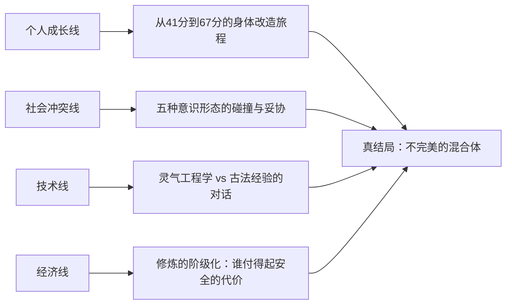

# 02_小说大纲与叙事架构

> **一句话版**：一个灵根 41 分的普通人，在灵气回归的 2035 年，从终南山脚下的免费体验站出发，穿越五种意识形态的交锋、修炼事故的代价和身份认同的瓦解，最终在废墟与妥协中拼出一个不完美但能运行的世界。
> **关联文档**：[[01_序章脚本：灵气回归之日]] · [[01_势力机构与学派冲突]] · [[02_意识形态对抗深度设计]] · [[02_修炼体系与人体映射]] · [[04_走火入魔机制]]

---

## 叙事框架

综合 **Save the Cat** 十五节拍 + **三幕结构** + **起承转合**，适配本项目的五大意识形态对抗主线。

### 故事类型

**制度化怪物（Institutionalized）** — 故事核心不是打怪升级，而是 _个人 vs 系统_：主角在五种制度正义中反复被碾压、被利用、被拯救，最终不得不在残缺选项中做出自己的回答。

### 核心主题

> **修炼的真正敌人不是天赋不够，而是你永远无法同时满足安全、自由和公平。**

---

## 全局架构：四卷制

| 卷 | 标题 | 对应三幕 | 修炼阶段 | 核心冲突 | 时间线 |
|----|------|----------|----------|----------|--------|
| **序** | 灵气回归之日 | 开场/催化 | 普通人→感气 | 个人对灵气的第一次接触 | 2035年9月 |
| **一** | 入门者的代价 | 第一幕 | 感气→引气→筑基 | 三派入门：谁在保护你，谁在利用你 | 2035.10–2036.6 |
| **二** | 制度的战场 | 第二幕 | 筑基→开窍 | 五大意识形态正面交锋，主角被迫选边 | 2036.7–2037.12 |
| **三** | 废墟中的选择 | 第三幕 | 开窍→金丹[未完成] | 真结局：在代价中保住希望 | 2038.1–2038.9 |

---

## 序：灵气回归之日

**（已完成，见 14_序章脚本）**

Save the Cat 节拍：
- **Opening Image**：手机震动，窗外秦岭
- **Theme Stated**："灵根评分受环境影响，非固定属性"
- **Set-Up**：新闻、评论区、社会张力
- **Catalyst**：第一次感气成功
- **Debate**：三条路线选择——学院/古法/开源

---

## 第一卷：入门者的代价

### 核心问题

> 你以为自己在学修仙，但每一个教你修仙的人都有自己的账本。

### 1.1 新世界的规则（胎息期）

**场景**：主角选择初始阵营后的第一个月。

| 路线 | 初期体验 | 隐藏代价 |
|------|----------|----------|
| **学院派** | 恒温修炼舱 + AI 实时监控 + 安全标准流程 | 所有数据归 QESA 存档，功法受限于审批清单 |
| **古法派** | 翠华山夜修 + 萤石辅助 + 口传心法 | 没有安全网，师父的权威不容质疑 |
| **开源社区** | GitHub repo + 社区讨论 + 自制传感器 | 质量参差，出事没人兜底 |

**关键事件**：主角在各自路线中遭遇**第一次真正的走火入魔**（非序章的轻微预警，而是 Risk > 0.62 的橙色事件），亲身体验"代价"：
- 学院派路线：实验室同伴走火，被 QESA 强制隔离，信息封锁
- 古法派路线：师兄重伤，师父束手无策，用古法解释掩盖工程事故
- 开源社区路线：社区成员因使用未经验证的脚本走火，引发舆论和 QESA 介入

### 1.2 裂缝出现（练气期）

主角成功引气，开始接触到更深层的制度矛盾：

- **灵材黑市**：高纯度灵材被国家管控，普通修士只能用低纯度材料 → 污染型走火率是富人的 7 倍
- **功法专利**：企业开始对"优化过的修炼参数序列"申请专利 → 修炼要付订阅费？
- **古法封闭**：一些真正有效的古传功法被古法门派当作"入门筹码"——想学先当三年杂工
- **开源困境**：社区的代码被企业直接拿去商业化，贡献者没有任何回报

**Save the Cat：B Story** — 主角遇到一个来自不同阵营的人（爱情线/友情线），这个人的存在挑战了主角的阵营偏见。

### 1.3 筑基的门票（筑基期）

筑基 = 第一次不可逆的身体改造。风险暴增。

**核心张力**：筑基需要高纯度灵材 + 安全环境 + 专业监控，三者同时满足的门槛极高。

- **学院派路线**：筑基排队等半年，资源优先分配给"高适配分"的人 → 主角 43 分排在后面
- **古法派路线**：师父说"够了就去冲"——但没有人确切知道"够"是什么标准
- **开源社区路线**：社区正在众筹建设第一个"公共筑基舱"——但资金和设备都差得远

**第一卷高潮**：主角做出一个越界决定——**跨阵营获取资源**（比如学院派主角去黑市买灵材，或开源主角偷用了古法功法），并因此触发一次严重走火（Risk > 0.86），差点死掉。

**第一卷结尾**：主角勉强完成筑基，但付出了代价——身体留下永久性的轻微损伤（II 级后遗症），而且被原来的阵营发现了越界行为。他不再是一个纯粹的"学院派/古法派/开源派"，而是一个各方都不完全信任的边缘人。

> **转折**：主角的灵根评分在筑基后跃升到 67，因为身体改造后与环境的耦合方式改变了。但他同时意识到——评分高了，所有人看他的眼神都变了。

### 第一卷章节节拍表

| # | 标题 | Save the Cat 节拍 | 修炼阶段 | 叙事目标 | 关键场景 | 伏笔/回收 |
|---|------|-------------------|----------|----------|----------|-----------|
| 1-1 | 新手村 | Fun & Games 开端 | 感气·巩固 | 展示初始阵营的日常 | 第一次规律修炼；AI 道侣日报（学院派）/ 师父讲古（古法派）/ PR review（开源派） | **埋**：同门/队友中有人进度异常快 |
| 1-2 | 第一课 | Fun & Games | 感气·中期 | 学习第一套正式功法 | 清源引气诀 SOP 学习；王芸讲解灵根非固定 | **埋**：古法门派的传承选拔暗线 |
| 1-3 | 灵材的价格 | Fun & Games | 感气·后期 | 引入经济线 | 主角发现好灵材贵得离谱；遇到 B Story 角色 | **埋**：灵材黑市线索 |
| 1-4 | 有人倒下了 | Bad Guys Close In | 引气·初入 | 第一次目睹真正的走火 | 同伴 Risk 突破 0.62 → 橙色事件；不同阵营处理方式对比 | **回收**：1-1 中进度异常快的人= 走火者 |
| 1-5 | 封锁与追问 | Bad Guys Close In | 引气·初期 | 走火事件的社会后果 | QESA 介入调查；信息分级管控；主角被盘问 | **埋**：QESA 内部有人在推灵材国有化 |
| 1-6 | 另一种声音 | B Story 深化 | 引气·中期 | B Story 角色正式加入 | 主角和 B Story 角色一起修炼；发现对方阵营没那么坏 | **埋**：B Story 角色有自己的隐秘目的 |
| 1-7 | 裂缝 | Midpoint（假胜利） | 引气·后期 | 引气成功 = 阶段性胜利 | 引气完成的仪式/测试；适配分 43→51 | **回收**：王芸"灵根非固定"的验证 |
| 1-8 | 专利风暴 | Bad Guys Close In | 引气·稳定 | 引入功法专利和经济压力 | 某企业申请功法参数序列专利；社区炸锅 | **埋**：DaoOS 的前身在幕后推动 |
| 1-9 | 筑基倒计时 | Bad Guys Close In | 筑基前准备 | 展示筑基的高门槛 | 材料、环境、监控——三者缺一不可；主角算账发现差距 | **回收**：灵材黑市线索浮出水面 |
| 1-10 | 越界 | All Is Lost | 筑基尝试 | 主角跨阵营获取资源 | 偷偷联系其他阵营；拿到了需要的东西，但被发现 | **转折点**：混合身份的开始 |
| 1-11 | 走火 | Dark Night of the Soul | 筑基中 | 筑基走火——最危险的时刻 | Risk 突破 0.86 → 红色失控；AI 道侣紧急干预；多阵营知识联合救命 | **回收**：所有走火机制知识的总检验 |
| 1-12 | 边缘人 | Break into Three | 筑基完成 | 筑基成功但付出代价 | 灵根 67 但 II 级后遗症；阵营信任崩裂；新的自我认知 | **埋**：67 分引发各方注意——拉拢开始 |

---

## 第二卷：制度的战场

### 核心问题

> 五种制度都声称在拯救世界。但当它们碰撞时，被碾碎的永远是最底层的人。

### 2.1 算法天道的入场

**Time**: 2036 年秋。一个名叫"天道系统"（DaoOS）的 AI 修炼平台横空出世。

它的承诺：
- 利用深度学习对每个人的 G 向量实时建模
- 自动匹配最优环境 × 材料 × 功法 × 节奏
- 走火预测准确率 99.2%
- **免费基础版 + 付费高级版的商业模式**

它做到了。用户修炼效率提升 300%，走火率降至 QESA 标准的 1/10。

**但代价是**：用户必须将所有身体数据、修炼记录、位置信息、甚至梦境日志上传到云端。退出系统后，所有个性化修炼参数随之失效——你变得"离开系统就不会修炼"。

### 2.2 五派正面交锋

| 事件 | 涉及势力 | 主角处境 |
|------|----------|---------|
| **灵材国有化法案** | QESA vs 古法门派 vs 企业 | 主角的灵材来源被切断 |
| **开源修炼合法化听证** | 开源社区 vs QESA | 主角被传唤作证——曾用过未授权功法 |
| **DaoOS 用户成瘾事件** | 算法天道 vs 所有人 | 主角认识的人开始"离不开系统" |
| **古法门派内部分裂** | 古法保守 vs 古法革新 | 师父的立场不再像以前那么绝对 |
| **公共修炼权运动** | 开源+部分学院 vs QESA+企业 | 终南山体验站被关闭，社区修炼站被查封 |

### 2.3 B Story 高潮

B Story 中的那个人——来自不同阵营的伙伴——在一次复合型走火事故中重伤。主角能联系到最好的救治资源（学院的设备 + 古法的经验 + 社区的数据），但这需要同时获得三个阵营的信任。

**All Is Lost / Dark Night**：主角尝试跨阵营合作救人，但每个阵营都在救治过程中试图加入自己的条件：
- QESA 说：数据必须归我们
- 古法说：功法不可外泄
- DaoOS 说：只有我们的模型能算出最优解，但你得签终身用户协议
- 开源说：全部公开！——但如果公开，QESA 会来查封

主角被迫做出一个**所有选项都不完美的决定**。

### 第二卷章节节拍表

| # | 标题 | Save the Cat 节拍 | 修炼阶段 | 叙事目标 | 关键场景 | 伏笔/回收 |
|---|------|-------------------|----------|----------|----------|-----------|
| 2-1 | 67 分的滋味 | 新幕开场 | 筑基·稳定 | 展示筑基后的新世界 | 多方拉拢；主角感知维度升级；后遗症日常影响 | **回收**：1-12 各方注意；**埋**：DaoOS 前兆 |
| 2-2 | 听证 | 制度压力加码 | 筑基·深化 | QESA 找上门 | 开源修炼合法化听证；主角被传唤作证 | **回收**：1-10 跨阵营行为的法律后果 |
| 2-3 | 天道降临 | 新角色/新势力 | 筑基→开窍前 | DaoOS 登场 | DaoOS 发布会；免费版体验；惊人效率 | **埋**：成瘾机制、数据垄断 |
| 2-4 | 国有化 | 社会冲突升级 | 开窍准备 | 灵材国有化法案冲击波 | 黑市关闭；古法门派被搜查；主角灵材断供 | **回收**：1-5 QESA 内部推手 |
| 2-5 | 革新派 | 阵营内部裂变 | 开窍准备 | 古法门派分裂 | 师父与师叔的对话——封闭 vs 公开部分传承 | **埋**：革新派将成为终局关键盟友 |
| 2-6 | 免费的代价 | Fun & Games（暗面） | 开窍·初入 | DaoOS 成瘾问题暴露 | 主角的朋友变成 DaoOS 依赖者；退出后修炼能力归零 | **回收**：2-3 埋下的隐忧 |
| 2-7 | 公共修炼权 | B Story + 社会线交汇 | 开窍·初期 | 运动兴起 | 终南山体验站被查封；王芸被拘留；社区抗议 | **回收**：序章中的体验中心 → 情感打击 |
| 2-8 | 地下实验室 | Midpoint（假胜利） | 开窍·中期 | 主角建立跨阵营暗网 | 秘密联合三派资源的实验空间；开窍初步成功 | **埋**：这个空间将成为救人的场所 |
| 2-9 | DaoOS 内部 | 调查线 | 开窍·中期 | 揭露 DaoOS 的算法 | 主角渗透 DaoOS 内部——发现 AI 在主动调整用户的 G 向量偏好 | **埋**：DaoOS 创始人的真实意图 |
| 2-10 | 走火·复合型 | All Is Lost | 开窍·后期 | B Story 角色重伤 | 四因子复合型走火：过载 + 污染 + 失谐 + 心理叠加；Risk > 0.86 | **回收**：风险函数全部分量同时触发 |
| 2-11 | 条件 | Dark Night | 开窍·后期 | 救治中的政治博弈 | 四方各提条件；主角在病床前崩溃；"没有一个选项是干净的" | **高潮转折**：主角被迫公开部分数据 |
| 2-12 | 余震 | Break into Three | 开窍·稳固 | 救治成功但代价惨重 | B Story 角色活了但永久性降阶；主角的数据被多方掌握 | **埋**：这些数据将在第三卷引发全球事件 |
| 2-13 | 五派暗桌 | 集结点 | 开窍·后期 | 意识形态总对决的序曲 | 五方代表第一次坐在同一张桌子前——因为灵气波动异常 | **埋**：LEVSS 场强突增预兆 |

---

## 第三卷：废墟中的选择

### 核心问题

> 真结局不是证明谁对谁错，而是在废墟中拼出一个能运行的东西。

### 3.1 系统性危机

2038 年初，一件事让一切加速：

**LEVSS 场强突增事件** — 太阳系进入暗物质壁的密度峰值区域。全球灵气浓度在两周内翻倍。

后果：
- 所有现有的安全阈值失效
- 大规模走火事件（全球超过 10 万起）
- DaoOS 的 AI 模型因为训练数据不含这种异常而预测失准
- 古法门派的老人说"这跟古籍里的描述吻合了"——但他们也不知道该怎么办
- 开源社区 24 小时内发布了紧急补丁——但没有经过验证
- QESA 宣布全国戒严，禁止一切非授权修炼

### 3.2 主角的选择

主角此时已经开窍，正在冲击金丹的边缘。但金丹需要稳定的高灵环境——而现在所有环境都极不稳定。

主角面前有五条路——**每条路都通向一个不完美的结局**：

| 路线 | 核心行动 | 代价 |
|------|----------|------|
| **接受 QESA 保护** | 进入国家级修炼庇护所 | 放弃自主权，成为体制的一部分 |
| **加入 DaoOS** | 用算法换安全 | 成为数据的附庸，永远离不开系统 |
| **跟古法遁世** | 隐匿山林深处自修 | 放弃社会连接，与世隔绝 |
| **all-in 开源** | 公开所有数据和方案 | 面临法律风险、错误传播、和代码被滥用 |
| **混合路线** | 从每个阵营取一部分 | 最难走，谁都不完全信任你 |

### 3.3 真结局（混合路线）

> **目标不是证明哪一派绝对正确，而是让玩家感受到：每一种胜利都带着代价，真正困难的是在代价中保住希望。**

主角选择混合路线，拼出一个**不完美但能运行的方案**：

1. **保住开源模型的独立性** — 核心算法不归任何单一实体控制
2. **接受 QESA 的基础安全框架** — 硬性安全阈值由国家监管，换取合法运行空间
3. **赢得部分古法高阶传承的公开授权** — 古法门中的革新派同意公开一部分经验数据
4. **拒绝 DaoOS 的全面接管** — 但保留了它的部分诊断算法（开源化了的版本）
5. **让至少一个社区级自治修炼节点存活下来** — 终南山的体验站重新开放，但不再完全免费也不完全受控

金丹未完成。主角停在了开窍后期。但这不是失败——而是他意识到，**金丹不是在实验室密闭环境中靠个人完成的，而是需要整个社会的知识基础设施到位之后才能稳定实现的**。

这就是"代际加速"的真正含义：**不是一个天才飞升，而是一代人的失败数据变成下一代人的公共知识。**

### 第三卷章节节拍表

| # | 标题 | Save the Cat 节拍 | 修炼阶段 | 叙事目标 | 关键场景 | 伏笔/回收 |
|---|------|-------------------|----------|----------|----------|-----------|
| 3-1 | 暴风前夜 | 新幕开场 | 开窍·后期 | 全球异变开始 | LEVSS 读数异常；QESA 紧急会议；比特/灵气双重恐慌 | **回收**：2-13 波动预兆 |
| 3-2 | 灵潮 | Catalyst→加倍 | 开窍·后期 | 灵气浓度翻倍 | 全球走火事件井喷；DaoOS 预测失准；古法老人的预言 | **回收**：08_ 暗物质壁理论的实证 |
| 3-3 | 戒严令 | Bad Guys Close In | 开窍→金丹门槛 | QESA 全面管控 | 戒严宣布；修炼许可证制度；黑市彻底瓦解 | **回收**：1-5 灵材国有化的终极形态 |
| 3-4 | 补丁与遗书 | Bad Guys Close In | 金丹门槛 | 各方应急方案暴露缺陷 | 开源补丁误伤事件；古法祖师关封山令；DaoOS 试图趁乱收割用户 | **人物弧**：每个阵营的"肮脏秘密"浮出水面 |
| 3-5 | 最后一课 | B Story 收束 | 金丹尝试 | 师父/导师的告别 | 师父（或导师/王芸）将毕生经验传授主角——不是功法，是判断力 | **回收**：所有导师线的情感总结 |
| 3-6 | 桌上摊牌 | Midpoint（真相） | 金丹准备 | 五方谈判 | 主角以"唯一同时被五方拉拢过的人"身份主持谈判 | **回收**：主角的"边缘人"身份反而成为核心资产 |
| 3-7 | 每一种胜利的代价 | All Is Lost | 金丹尝试 | 谈判破裂 | DaoOS 创始人掀桌——"如果不能全面接管，我就公开所有用户隐私数据" | **高潮启动**：DaoOS 与其他四方开战 |
| 3-8 | 终南山之战 | Finale（集结） | 金丹中 | 武力+数据+信念总对决 | 终南山成为战场——物理走火 + 数据战 + 舆论战同时进行 | **回收**：终南山=故事开始和结束的地方 |
| 3-9 | 混合体 | Finale（执行） | 金丹中[未完成] | 主角拼出不完美方案 | 保住开源独立性 + 接受安全框架 + 赢得古法授权 + 拒绝全面接管 + 社区节点存活 | **回收**：每一条线的最终落点 |
| 3-10 | 下一代的种子 | Final Image | 开窍·后期（金丹未成） | 尾声——代际加速 | 主角把失败数据开源；一年后，终南山体验站重开；一个 16 岁的孩子走进来 | **回收**：序章的镜像——但世界已经不同 |

---

## 伏笔管理总账

| 伏笔名 | 埋入 | 回收 | 类型 |
|--------|------|------|------|
| 同门进度异常 = 潜在走火者 | 1-1 | 1-4 | 短线 |
| 灵根非固定 | 序章 | 1-7, 3-10 | 贯穿 |
| 灵材黑市 | 1-3 | 1-9, 2-4, 3-3 | 长线 |
| QESA 内部推灵材国有化 | 1-5 | 2-4, 3-3 | 长线 |
| DaoOS 成瘾机制 | 2-3 | 2-6, 3-4, 3-7 | 中线 |
| 古法革新派 | 2-5 | 3-6, 3-9 | 中线 |
| B Story 角色隐秘目的 | 1-6 | 2-10, 2-11 | 中线 |
| 主角数据被多方持有 | 2-12 | 3-7 | 长线 |
| LEVSS 场强异常 | 2-13 | 3-1, 3-2 | 短线 |
| 终南山 = 起源与终点 | 序章 | 3-8, 3-10 | 贯穿 |

---

## 主要角色

| 角色 | 身份 | 代表意识形态 | 与主角关系 |
|------|------|------------|-----------|
| **主角** | 灵根 41→67，三派边缘人 | 混合/未定 | — |
| **王芸** | 社区修炼指导员 | 开源共修 | 导师/窗口人物 |
| **导师（学院）** | QESA 研究员 | 国家官僚 | 提供安全但要求服从 |
| **师父（古法）** | 翠华山隐修者 | 古法保守 | 教真本事但控制信息 |
| **B Story 角色** | 来自对立阵营 | TBD | 挑战主角偏见的人 |
| **DaoOS 创始人** | 前 AI 研究员 | 算法天道 | 第二卷主要对手 |
| **开源核心贡献者** | 匿名程序员群体 | 开源共修 | 主角的盟友和批评者 |

---

## 核心冲突线

---

## 叙事原则

1. **没有绝对反派** — 每个阵营都有合理性，也都有肮脏秘密
2. **走火不是剧情工具，是系统输出** — 每次走火必须可以用 Risk 函数回溯
3. **灵根评分动态变化** — 主角的 L_fit 随每次环境/材料/功法变化而变
4. **经济是真实的** — 主角需要付房租、买灵材、选择免费还是付费服务
5. **信息不对等** — 读者和主角一起慢慢发现真相，没有全知视角
6. **代际加速是主题** — 主角一个人凝不成丹，但他的失败数据会帮助下一代

---

## 章节预算

| 卷 | 预计章数 | 预计字数 | 状态 |
|----|----------|----------|------|
| 序 | 5 节 | ~15,000 | ✅ 完成（14_序章脚本） |
| 一 | 12 章 | ~60,000 | ✅ 章节节拍完成 |
| 二 | 13 章 | ~70,000 | ✅ 章节节拍完成 |
| 三 | 10 章 | ~50,000 | ✅ 章节节拍完成 |
| **总计** | **~40 章** | **~195,000** | — |

---

## 与设定文档的对接

| 小说事件 | 引用设定文档 |
|----------|------------|
| 灵气浓度飙升 | `08_修仙隐匿史与LEVSS波动理论` · 双重穿越理论 |
| 走火入魔事故 | `12_走火入魔机制` · 四种类型 × 事件树 |
| 灵材选择困境 | `04_灵材丹药与法器目录` · 规则集 A |
| DaoOS AI 系统 | `06_高阶境界、AI修炼与终局形态` |
| 五派意识形态 | `09_意识形态对抗深度设计` · 五种肮脏秘密 |
| 修炼效率计算 | `10_物理公式与参数手册` · L_fit / Risk 函数 |
| 功法操作规程 | `11_功法示例：清源引气诀` |

### 核心问题

> 你以为自己在学修仙，但每一个教你修仙的人都有自己的账本。

### 1.1 新世界的规则（胎息期）

**场景**：主角选择初始阵营后的第一个月。

| 路线 | 初期体验 | 隐藏代价 |
|------|----------|----------|
| **学院派** | 恒温修炼舱 + AI 实时监控 + 安全标准流程 | 所有数据归 QESA 存档，功法受限于审批清单 |
| **古法派** | 翠华山夜修 + 萤石辅助 + 口传心法 | 没有安全网，师父的权威不容质疑 |
| **开源社区** | GitHub repo + 社区讨论 + 自制传感器 | 质量参差，出事没人兜底 |

**关键事件**：主角在各自路线中遭遇**第一次真正的走火入魔**（非序章的轻微预警，而是 Risk > 0.62 的橙色事件），亲身体验"代价"：
- 学院派路线：实验室同伴走火，被 QESA 强制隔离，信息封锁
- 古法派路线：师兄重伤，师父束手无策，用古法解释掩盖工程事故
- 开源社区路线：社区成员因使用未经验证的脚本走火，引发舆论和 QESA 介入

### 1.2 裂缝出现（练气期）

主角成功引气，开始接触到更深层的制度矛盾：

- **灵材黑市**：高纯度灵材被国家管控，普通修士只能用低纯度材料 → 污染型走火率是富人的 7 倍
- **功法专利**：企业开始对"优化过的修炼参数序列"申请专利 → 修炼要付订阅费？
- **古法封闭**：一些真正有效的古传功法被古法门派当作"入门筹码"——想学先当三年杂工
- **开源困境**：社区的代码被企业直接拿去商业化，贡献者没有任何回报

**Save the Cat：B Story** — 主角遇到一个来自不同阵营的人（爱情线/友情线），这个人的存在挑战了主角的阵营偏见。

### 1.3 筑基的门票（筑基期）

筑基 = 第一次不可逆的身体改造。风险暴增。

**核心张力**：筑基需要高纯度灵材 + 安全环境 + 专业监控，三者同时满足的门槛极高。

- **学院派路线**：筑基排队等半年，资源优先分配给"高适配分"的人 → 主角 43 分排在后面
- **古法派路线**：师父说"够了就去冲"——但没有人确切知道"够"是什么标准
- **开源社区路线**：社区正在众筹建设第一个"公共筑基舱"——但资金和设备都差得远

**第一卷高潮**：主角做出一个越界决定——**跨阵营获取资源**（比如学院派主角去黑市买灵材，或开源主角偷用了古法功法），并因此触发一次严重走火（Risk > 0.86），差点死掉。

**第一卷结尾**：主角勉强完成筑基，但付出了代价——身体留下永久性的轻微损伤（II 级后遗症），而且被原来的阵营发现了越界行为。他不再是一个纯粹的"学院派/古法派/开源派"，而是一个各方都不完全信任的边缘人。
