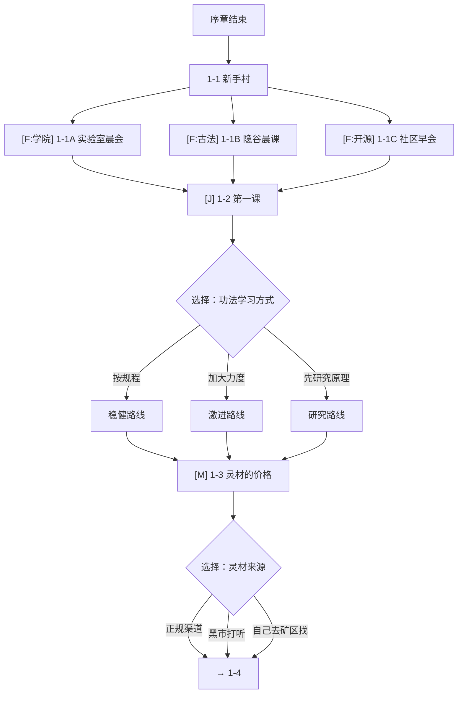

# 03-1_第一卷开局变量与场景1-1

> 拆分自 [[03_第一卷游戏脚本]]，对应原文 变量表、节点图与场景 1-1。
> **注**：本文已按当前六境体系收口，原脚本中的“感气/引气”阶段概念分别并入 `练气一层/练气二层`；`清源引气诀` 作为功法名保留。

## 变量表

| 变量 | 初始值（从序章继承） | 类型 | 说明 |
|------|---------------------|------|------|
| `faction` | 学院/古法/开源 | enum | 序章末选择 |
| `L_fit` | 43 | int（0-100） | 灵根适配评分 |
| `stage` | 练气一层 | enum | 修炼阶段 |
| `Risk` | 0.05 | float（0-1） | 当前走火风险 |
| `Poll` | 0 | float（0-100） | 累积污染 |
| `money` | 3200 | int | 月度可支配（元） |
| `rep_academy` | 序章选择决定 | int（-100~100） | 学院好感 |
| `rep_ancient` | 序章选择决定 | int（-100~100） | 古法好感 |
| `rep_opensource` | 序章选择决定 | int（-100~100） | 开源好感 |
| `injury` | 0 | enum（0/I/II/III） | 后遗症等级 |
| `day` | 1 | int | 第一卷内天数 |

---

## 场景节点图（第一卷 1-1 → 1-3）



---

## 场景 1-1：新手村 [M→F分支]

> **叙事目标**：展示初始阵营日常，让玩家建立归属感
> **天数**：Day 3-7（序章后第 3-7 天）
> **数值事件**：`L_fit` 微微波动（±1），展示适配分动态性

### 开场（共享）

```
第三天。

你已经习惯了每天早晨醒来时那种微妙的感觉——空气里有什么东西在
轻轻推着你的皮肤。自从那天在体验中心第一次感到灵气之后，这种
感知就再也关不掉了。

像学会了一种新的味觉。你不能"不尝"，只能选择留意或忽略。

  📊 AI道侣·晨报:
  ├ 修炼阶段: 练气一层
  ├ 灵根适配: 43/100
  ├ 昨日修炼: 未进行
  ├ Risk: 0.05 (安全)
  ├ Poll: 0 (清洁)
  └ 建议: 今日可进行第二次正式修炼

你今天要去——
```

---

### [F:学院] 场景 1-1A：实验室晨会

> 条件：`faction == 学院`

```
南瞻学院网灵气工程系。外环实验楼 B4 地下二层。

门禁扫了你的 QESA 临时通行证。走廊里的空调声很稳定，恒温恒湿
——你已经知道这不只是为了人的舒适，而是因为灵气传导对温度和
湿度波动极其敏感。

实验室里七个人。导师赵铭北靠在白板前，白板上画着经脉导灵的
流体力学简图。

"昨天的数据。" 赵铭北把平板扔到桌上。

  ┌──────────────────────────────────┐
  │  B4-02 修炼舱 · 昨日汇总         │
  ├──────────────────────────────────┤
  │  编号    L_fit   纳灵稳定度  异常  │
  │  S-001   67     98.3%      无    │
  │  S-002   54     91.7%      无    │
  │  S-003   43     78.4%      无 ←你│
  │  S-004   51     85.2%      无    │
  │  S-005   71     99.1%      无    │
  │  S-006   38     62.3%      ⚠轻微 │
  │  S-007   62     96.8%      无    │
  └──────────────────────────────────┘

"78.4%。" 赵铭北看了你一眼，"不差，但也不是能放松的数字。
S-005 周同学已经稳定在 99% 以上了——当然你们的适配分差了
28 分，不能直接比。"

S-006，林越，缩了缩脖子。62.3%，而且有轻微异常标记。

赵铭北继续："今天进修炼舱之前，先过一遍清源引气诀的前三段
操作规程。谁能背出第二段的呼吸参数？"
```

**选择 A**：举手回答（你昨晚研究过了）
```
  效果: rep_academy +5 | 赵铭北好感 +3
  → 进入 1-1A_2（获得优先修炼时段）
```

**选择 B**：低头不说话，让周同学答
```
  效果: 无变化
  → 进入 1-1A_2（正常排队）
```

**选择 C**：偷偷看向 S-006 林越的表情
```
  效果: 触发林越支线标记 | 获得观察: "林越最近压力很大"
  → 进入 1-1A_2（正常排队）
```

> **设计意图**：选择 C 是伏笔——林越就是 1-4 中走火的人。提前观察到他的异常，在 1-4 时玩家会有"我早该发现"的情感冲击。

#### 1-1A_2：修炼舱

```
修炼舱编号 B4-02-3。1.5米×2米的隔音空间，温度 22.0°C，
湿度 45%。蒲团下嵌了一块实验室级石英晶片——纯度远高于
体验中心那块。

你感受到了差异。

坐下的瞬间，灵气的感觉就不一样了——更清晰、更"干净"。
像从收音机换成了 Hi-Fi 音箱，信号是一样的，但噪声消失了。

  📊 AI道侣·修炼中:
  ├ 环境适配: 优秀（恒温恒湿 + 高纯石英）
  ├ 灵气输入速率: 0.09 Qu/s
  ├ L_fit 实时: 45 (环境加成 +2)
  ├ Risk: 0.06
  └ 修炼模式: 标准·清源引气诀·第一段

四十分钟后。

你的第二次正式修炼结束。比体验中心那次平稳得多——没有冲动，
没有贪念，只有安安静静地呼吸和聆听。

  📊 修炼报告:
  ├ 时长: 40min
  ├ 纳灵稳定度: 81.2% (↑2.8%)
  ├ L_fit: 43 → 44 (微调，非永久)
  ├ Risk_peak: 0.09 (安全)
  ├ Poll: 0 (清洁)
  └ 阶段进度: 练气一层 ██░░░░░░░░ 12%
```

`→ 汇合到 1-2`

---

### [F:古法] 场景 1-1B：隐谷晨课

> 条件：`faction == 古法`

```
凌晨四点半。手机闹钟没响——师父不允许修炼时段带电子设备。

终南隐谷南坡，一处没有路标的石台。晨雾浓得看不到十米外的
松树。你是三个弟子中最晚到的——另外两个人已经在打坐了。

师兄陈渊，二十八岁，三年前入门。坐姿挺拔，呼吸几乎听不到。
师姐叶蓁，二十五岁，两年前入门。闭着眼，眉心有汗珠。

师父坐在石台最高处。没有蒲团——他直接坐在石头上。身前放着
三块石头：一块萤石（暗绿）、一块黄铁矿（金色）、一块云母
（银片状）。

"来了。" 他没有睁眼。"拿你的。"

你拿起萤石——上次师父给你的那一块。掌心传来一种微凉的
触感，和石英的感觉完全不同。

"今天学两个字：守、放。"

师父终于睁开眼："守——气来了不去抓，让它自己在丹田里打转。
放——气满了不贪，主动让它从涌泉穴散出去。你们学院那边叫
什么？" 他想了想，"叫'被动循环与主动泄压'。一个意思。"

叶蓁小声嘀咕："那为什么不直接用学院的说法——"

"因为你听不懂那些公式。" 师父的语气不重但很确定，"等你
身体记住了这两个字，再去看公式，就知道公式在说什么。
顺序搞反了。"
```

**选择 A**：问师父："守和放的边界怎么判断？"
```
  效果: 师父传授"体感判断法" | rep_ancient +5
  → 进入 1-1B_2（附加教学 + 修炼）
```

**选择 B**：不说话，直接开始按师父说的做
```
  效果: rep_ancient +3 | 修炼效率 +5%（专注度高）
  → 进入 1-1B_2（修炼）
```

**选择 C**：心里想的是叶蓁说得对——但你不敢说出来
```
  效果: 内心矛盾标记 +1 | 无好感变化
  → 进入 1-1B_2（修炼）
```

#### 1-1B_2：石台修炼

```
你坐在萤石旁边。

没有恒温恒湿，没有 AI 道侣实时监控——你的手腕上确实戴着
那个传感环，但师父嗤之以鼻地把它叫"电子拐杖"。

"先别看那个东西。用自己的身体感觉。"

你闭上眼。灵气从萤石的方向涌来——比石英的感觉更柔和，
像流水而不是振动。师父说你的主频是木，萤石比石英匹配度高。

守。

气在丹田慢慢打转。你试着不去干预它的方向。

放。

当那种"饱胀感"到达一个程度——你凭直觉，在呼气的末端，
把注意力从丹田移到脚底。多余的气像热水一样慢慢流下去。

一个小时后。

你才看了一眼手腕上的传感器：

  📊 AI道侣（后台记录，师父禁止修炼中查看）:
  ├ 环境适配: 中等（野外，温湿度波动大）
  ├ 灵气输入速率: 0.06 Qu/s（低于实验室）
  ├ L_fit 实时: 47 (萤石+木频匹配加成 +4)
  ├ Risk_peak: 0.11
  ├ Poll: 0.3 (微量·萤石含氟)
  └ 阶段进度: 练气一层 ██░░░░░░░░ 15%

有意思。L_fit 47——比昨天的 43 高了 4 分。不是你变强了，
是灵材换对了。

但 Poll 出现了 0.3——萤石含氟化钙，天然矿物里有微量杂质。
师父没提过这个。
```

> **设计意图**：Poll 0.3 是第一次出现污染值。古法派不用 AI 监控 = 不知道自己在积累污染。这是古法路线的隐性代价，会在后续章节累积。

`→ 汇合到 1-2`

---

### [F:开源] 场景 1-1C：社区早会

> 条件：`faction == 开源`

```
终南隐谷外缘，一栋改造过的民宿二楼。

七台显示器、三个投影仪、一整面墙的白板，上面写满了公式和
TODO 列表。角落里有一台自制的灵气浓度探测器——用的是淘宝
买的压电传感器加上 ESP32 开发板。

这就是 OpenQi 终南隐谷社区节点。

今天的晨会只有五个人到场（线上十几个）。主持人"根号三"
——没人知道他的真名——正在 share screen：

  ┌──────────────────────────────────────┐
  │  OpenQi Weekly #47                    │
  ├──────────────────────────────────────┤
  │  PR merged:                           │
  │    #891 经脉阻抗模型 v0.3.2           │
  │    #894 走火风险计算器 bug fix         │
  │    #897 社区修炼数据匿名上传 schema    │
  │                                       │
  │  Open issues: 362 (+15)               │
  │  走火事故报告: 本周 3 例（均为轻微）    │
  │                                       │
  │  讨论中:                               │
  │    → 是否接受 QESA 的"社区修炼站许可"？│
  │    → DaoOS 邀请集成我们的风险模型      │
  └──────────────────────────────────────┘

"上周的三例走火，" 根号三推了推眼镜，"全部是用了 #871 的
参数在 Q>4.0 环境下修炼的。#871 那个 PR 我们 review 不够
仔细——呼吸频率参数偏高了 12%。已经 hotfix 了。"

一个叫"菌丝"的女生举手："我觉得我们需要一个自动化的
安全审查 CI。每次有人提修炼参数相关的 PR，自动跑一遍
Risk 模型，超过 θ_warn 的直接 block。"

"赞成。谁来写？"

沉默。

根号三看向你："新人，你不是程序员背景吗？"
```

**选择 A**：接下这个任务——写安全审查 CI
```
  效果: rep_opensource +10 | 获得任务"安全审查CI"
  后续: 完成后解锁社区高级权限
  → 进入 1-1C_2
```

**选择 B**：说"我先跟着修炼几天再说"
```
  效果: rep_opensource +3 | 无额外任务
  → 进入 1-1C_2
```

**选择 C**：提问"DaoOS 邀请集成的事，你们打算怎么回？"
```
  效果: 触发 DaoOS 讨论 | 获得信息: 社区对 DaoOS 态度分裂
  → 进入 1-1C_2
```

#### 1-1C_2：民宿修炼（社区版）

```
晨会结束后是修炼时间。

没有实验室，也没有师父指导。菌丝给你分享了她的修炼配置文件：

  config/practice_profile_v3.yaml
  ──────────────────────────
  technique: 清源引气诀（社区改版 v1.2）
  breath_cycle: [4, 7, 8]
  material: 石英（淘宝购，纯度未认证）
  duration_max: 30min
  risk_threshold: 0.30
  auto_stop: true（手环 Risk 超阈值自动震动提醒）

你坐在民宿天台上。脚下是一块菌丝从闲鱼买的石英原石——
"检测过了，d33 约 2.3 pC/N，比实验室的差很多，但够用。"

修炼开始。

和学院的恒温舱完全不同——风在吹，鸟在叫，偶尔有车经过。
噪声从四面八方涌来。但终南隐谷的灵气浓度本身就高，冗余够大。

三十分钟后。手环震动——不是走火预警，是计时器。

  📊 AI道侣（开源版 v0.3.1，社区部署）:
  ├ 环境适配: 中等（野外，噪声中等）
  ├ 灵气输入速率: 0.05 Qu/s
  ├ L_fit 实时: 43 (无灵材加成)
  ├ Risk_peak: 0.13
  ├ Poll: 0.1 (石英纯度不足的微量污染)
  └ 阶段进度: 练气一层 ██░░░░░░░░ 10%

效率最低的一条路——但也是唯一完全由你自己控制的路。
```

`→ 汇合到 1-2`

---
